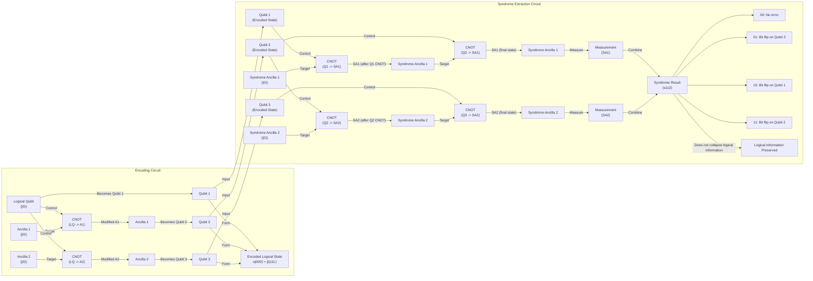

# The Quantum Bug in the Fabric of Spacetime

## The Quantum Computing Challenge and the Discovery of a Cosmic Connection

In 1994, mathematician Peter Shor introduced an algorithm that sent a shockwave through the worlds of computing and cryptography. He proved that a hypothetical “quantum computer” could factor large numbers exponentially faster than any known classical computer, rendering much of modern encryption breakable [[1]]. The excitement was immediate, but so was the skepticism. While the theory was beautiful, the hardware seemed impossible. Noise, it was argued, would be the fatal flaw. The problem was so severe that prominent researchers like Rolf Landauer suggested that papers on quantum computation should carry a disclaimer: "This proposal... probably will not work" [[2]].

Classical computers store information in bits, which hold a definite value of either 0 or 1. An n-bit register can therefore be in only one of 2^n possible states at any given time. Quantum computers use “qubits,” which can exist in a superposition of both states simultaneously. As qubits interact, they become entangled, their fates intertwined in a complex web of probabilities. This allows an n-qubit register to represent all 2^n classical states at once, enabling immense parallelism [[1]]. This is the power behind Shor's algorithm, which reduces the problem of factoring to finding the period of a function evaluated in a massive superposition.

But this power comes at a cost. Qubits are incredibly fragile. The slightest disturbance from the environment, such as a stray magnetic field or a flicker of microwave radiation, can cause a "bit-flip," swapping the probabilities of |0⟩ and |1⟩, or a "phase-flip," inverting the mathematical relationship between them. Crucially, you cannot simply measure the qubits to check for errors. The act of measurement collapses the superposition, destroying the very quantum state needed for the computation [[1]]. For years, it seemed that building a useful quantum computer was a staggering problem of engineering that might never be solved.

Then, in 1995, Shor delivered another breakthrough: a method for quantum error correction (QEC). He showed that it was possible to detect and fix errors without measuring the qubits directly [[2]]. A year later, independent groups of researchers, including Dorit Aharonov and Michael Ben-Or, as well as Emanuel Knill, Raymond Laflamme, and Wojciech Zurek, built on his work to prove the "threshold theorem" [[2], [3]]. It states that as long as the error rate of individual quantum gates is below a certain constant threshold, you can perform arbitrarily long computations with arbitrarily high precision. According to quantum computer scientist Scott Aaronson, "This was the central discovery in the ’90s that convinced people that scalable quantum computing should be possible at all... that it is merely a staggering problem of engineering" [[1]]. Even with this theoretical foundation, the high error rates of real qubits remain a major obstacle. "The effort to design better codes is 'one of the major thrusts of the field,' Aaronson said, along with improving the hardware" [[1]].

For nearly two decades, the quest for better error-correcting codes was a central focus of quantum computing research. Then, in 2014, the story took an unexpected turn. Three young physicists, Ahmed Almheiri, Xi Dong, and Daniel Harlow, published a paper suggesting a profound link between quantum error correction and the very fabric of spacetime [[1], [4]]. They argued that in certain theoretical universes, the emergence of a smooth, geometric space-time from a chaotic quantum system works exactly like a quantum error-correcting code. Spacetime, they proposed, *is* a code.

This idea offers a deep explanation for the robustness of our universe. John Preskill, a theoretical physicist at Caltech, argues that spacetime doesn't feel fragile because it is, in essence, protected by an underlying error-correction structure. "We’re not walking on eggshells to make sure we don’t make the geometry fall apart,” he said. “I think this connection with quantum error correction is the deepest explanation we have for why that’s the case" [[1]]. Small errors in the underlying quantum description are corrected, leaving the large-scale geometry of the universe intact.

This unexpected connection has created a two-way street of discovery. Physicists hope that studying the error-correcting properties of spacetime could lead to new, more efficient codes for building quantum computers. As Almheiri noted, "Space-time is a lot smarter than us" [[1]]. At the same time, the language of quantum error correction is providing a powerful new toolkit for tackling some of the deepest mysteries in physics, particularly the paradoxes surrounding black holes.

With the Almheiri-Dong-Harlow conjecture establishing that holographic space-time behaves as a quantum error-correcting code, we now examine the concrete mechanics of how such codes protect logical information in simple qubit systems so you can recognize the same mathematical signatures when they reappear in the bulk geometry of AdS.

## How Quantum Error-Correcting Codes Work

### The Core Principle: Encoding in Entanglement

The central trick behind quantum error correction is to encode information not in a single, vulnerable qubit, but across a pattern of entanglement among many [[1]]. This distributes the logical information, making it robust against local errors. Instead of trusting one fragile physical qubit, we encode a single logical qubit across multiple physical qubits using highly entangled states. This ensures that no local operator can access or corrupt the logical information by interacting with just one or a few physical qubits. This approach cleverly circumvents the no-cloning theorem, which forbids making perfect copies of an unknown quantum state, by instead spreading the information non-locally [[2]].

### A Toy Model: The Three-Qubit Bit-Flip Code

A simple, instructive example is the three-qubit bit-flip code. While not fully practical because it only protects against bit-flips and not phase-flips, it clearly illustrates the core principle [[1], [2]]. In this code, one "logical" qubit of information is encoded using three "physical" qubits. The logical state |0⟩ is represented by the physical state |000⟩, and the logical state |1⟩ becomes |111⟩. A general state, α|0⟩ + β|1⟩, is encoded into the entangled superposition α|000⟩ + β|111⟩. This encoding is achieved by a quantum circuit that uses CNOT gates to copy the basis information of the logical qubit onto two ancilla qubits, creating the entangled state without cloning the original quantum state itself [[2]].

### Non-Demolition Error Detection

Suppose one of the physical qubits accidentally flips. How can we detect and correct this error without measuring any of the qubits directly and collapsing the superposition? The answer lies in "syndrome extraction." We can use a quantum circuit with two auxiliary qubits, called ancillas, to perform parity checks. One gate checks whether the first and second physical qubits are the same or different, and another checks the parity of the second and third. These measurements don't reveal the state of the logical qubit itself, only the relationships between the physical qubits [[2]].

Image 1: A quantum circuit diagram illustrating the encoding and syndrome extraction for the three-qubit bit-flip code.

The combination of these two parity checks yields a "syndrome" that uniquely identifies which qubit, if any, has flipped [[1]]. A syndrome of '00' indicates no error. A '10' signifies a flip on the first qubit, as it disagrees with both the second and third. A '11' points to an error on the second qubit, which disagrees with the first and third. Finally, a '01' indicates a flip on the third qubit [[2]]. Once the error is identified, a corrective operation can be applied to flip the errant qubit back, restoring the original encoded state without ever learning what that state was [[1]].

The best error-correcting codes have a remarkable property: they can typically recover all the encoded information even if you lose or corrupt just under half of the physical qubits. This "slightly more than half" rule is what caught the attention of Almheiri, Dong, and Harlow. They noticed that this same principle appeared to govern how spacetime emerges from quantum entanglement in certain theoretical models of the universe [[1]].

Equipped with the concrete mechanics and the "slightly more than half" correctability signature of qubit-based codes, we now show how the holographic principle implements precisely the same structure on a gravitational stage, with AdS geometry emerging from entangled boundary degrees of freedom.

## The Holographic Principle and Space-Time Emerges as a Quantum Error-Correcting Code

### AdS Space: A Holographic Sandbox

To understand the connection to spacetime, we first need to take a brief detour into theoretical physics' favorite sandbox: anti-de Sitter (AdS) space. Unlike our own universe, which has a positive vacuum energy causing it to expand (a "de Sitter" geometry), AdS space has a negative vacuum energy. This gives it a peculiar, hyperbolic geometry, famously visualized in M.C. Escher's *Circle Limit* woodcuts, where creatures become infinitely smaller as they approach the circular boundary [[1]].

<https://www.quantamagazine.org/wp-content/uploads/2019/01/Escher_1000.jpg>
Image 2: The hyperbolic geometry in M.C. Escher’s 1959 woodcut, Circle Limit III, is also a feature of anti-de Sitter space. (Source [https://en.wikipedia.org/wiki/Circle_Limit_III#/media/File:Escher_Circle_Limit_III.jpg](https://en.wikipedia.org/wiki/Circle_Limit_III#/media/File:Escher_Circle_Limit_III.jpg))

This boundary is crucial. In 1997, physicist Juan Maldacena discovered the AdS/CFT correspondence, a powerful duality suggesting that a theory of gravity within the "bulk" of AdS space is mathematically equivalent to a quantum field theory (specifically, a Conformal Field Theory or CFT) living on its lower-dimensional, gravity-free boundary [[1], [7]]. The bendy, geometric fabric of spacetime in the bulk emerges, like a hologram, from the entanglement of quantum particles on the boundary.

### Geometric Reconstruction as QEC

Almheiri and his colleagues noticed that this holographic emergence has the same mathematical signature as quantum error correction. They found that any point in the interior of AdS space could be constructed from the quantum state on slightly more than half of the boundary—the same "just over half" rule we saw in optimal QEC codes [[1], [4]]. In their 2014 paper, they proposed a simple toy model to illustrate this: a "three-qutrit code." In this model, a single point in the center of a 2D holographic universe is encoded in the entanglement of three qutrits (three-state quantum particles) on the circular boundary. The code protects the central point from the erasure of any one of the three boundary qutrits, just as the three-qubit code protects against a single bit-flip [[1], [5]].

### Tensor Networks: Building Spacetime from Entanglement

A single point is hardly a universe. In 2015, a team including Harlow and Preskill developed a more sophisticated model nicknamed the HaPPY code (after its authors: Harlow, Pastawski, Preskill, and Yoshida) [[1], [6]]. This code uses a network of "perfect tensors"—highly entangled multi-qubit states—arranged in a tiling of pentagons that mimics the hyperbolic geometry of AdS space. Each pentagon represents a point in spacetime. As Patrick Hayden of Stanford University described them, they are like "little Tinkertoys" that build the geometry [[1]]. In the HaPPY code, the region of the bulk that can be reconstructed from a given boundary region A is called the "entanglement wedge." Just as a logical qubit can be recovered from many different subsets of physical qubits, a bulk operator can be reconstructed from different overlapping regions on the boundary. "That’s where the error-correcting property comes in," Hayden explained [[1]].

However, while toy models like the HaPPY code successfully reproduce the error-correcting features of holography, they have a key limitation: the quantum states on their boundary do not behave like those in a real CFT. The strong, local error-correcting nature of the code prevents the smooth, polynomial decay of correlation functions expected in physical theories. A newer class of models, called Hyperinvariant Tensor Networks (HTNs), addresses this by using a more complex structure. HTNs can produce the correct physical correlation functions on the boundary, but they do so by softening a key property called "complementary recovery," making the reconstruction of bulk information dependent on the specific quantum state. This trade-off is thought to be more representative of holography in universes with quantum gravity corrections [[10]].

The broader lesson is that QEC provides the right language for describing how a smooth, classical-looking geometry emerges from a messy quantum substrate. As Preskill puts it, "It’s really entanglement which is holding the space together. If you want to weave space-time together out of little pieces, you have to entangle them in the right way. And the right way is to build a quantum error-correcting code" [[1]]. He believes this language should apply not just to toy AdS universes but to more general situations, including our own.

For now, researchers are sticking with AdS spaces, which are much simpler than de Sitter spaces but share many key properties including, most importantly, black holes. As Daniel Harlow of MIT notes, "The most fundamental property of gravity is that there are black holes. That’s what makes gravity different from all the other forces. That’s why quantum gravity is hard" [[1]]. The same QEC structure that protects smooth AdS geometry fails in the presence of black holes; we now examine the sharp breakdown of correctability at horizons and the resulting paradoxes that any consistent theory of quantum gravity must resolve.

## Black Holes: Where Correctability Breaks Down

### The Horizon as an Information Sink

Black holes represent the ultimate test for any theory of quantum gravity, and from the perspective of QEC, they are where the code breaks. Patrick Hayden defines a black hole's event horizon as the point where correctability fails: "When there are so many errors that you can no longer keep track of what’s going on in the bulk [space-time] anymore, you get a black hole. It’s like a sink for your ignorance" [[1]]. Once something crosses the horizon, it can no longer be reconstructed from local operators on the boundary.

This leads directly to Stephen Hawking's famous information paradox. In 1974, Hawking showed that black holes are not truly black; they radiate heat and eventually evaporate. His calculations suggested this "Hawking radiation" is thermal, meaning it is random and carries no information about what fell into the black hole. This would imply that information is permanently destroyed, violating a fundamental principle of quantum mechanics called unitarity [[1]]. A complete theory of quantum gravity must explain how this information gets out.

### A Shift in the Rules

In AdS universes, the holographic principle guarantees that information is never truly lost, as it is always encoded on the boundary. However, the presence of a black hole dramatically changes the rules of reconstruction. While a point in empty AdS space can be reconstructed from just over half of the boundary, reconstructing information from inside a black hole requires access to roughly three-quarters of the boundary qubits [[1]]. This shift in the reconstruction threshold is a critical clue about the nature of quantum gravity, though as Almheiri notes, why this specific fraction appears "is still an open question" [[1]].

### The Firewall Paradox

This tension came to a head in 2012 with the "firewall paradox," proposed by Almheiri and his collaborators [[8]]. They argued that three widely held beliefs could not all be true: (1) Hawking radiation is pure and carries information out, preserving unitarity; (2) an observer falling into a black hole experiences nothing unusual at the horizon (a smooth passage); and (3) known physics works outside the horizon. The problem arises from the "monogamy of entanglement," a quantum rule stating that a particle cannot be fully entangled with two separate systems at the same time. If a late-time Hawking particle is entangled with the early radiation (to carry information out) and also with its partner particle inside the horizon (to keep spacetime smooth), it would violate this rule. Their shocking conclusion was that the entanglement with the interior must break, creating a "firewall" of high-energy particles that would incinerate any infalling observer [[1], [8]].

### QEC to the Rescue

Quantum error correction may offer a way out. Almheiri now speculates that QEC is what prevents firewalls from forming, protecting the entanglement that holds spacetime together even at the horizon. He reported that QEC is "essential for maintaining the smoothness of space-time at the horizon" of a wormhole, a two-mouthed black hole [[9]]. The idea is that information can escape through tiny "wormholes" created by entanglement between the inside and outside (a concept known as ER=EPR), and QEC is the mechanism that makes this possible without violating quantum rules [[1]]. This framework allows the interior to be reconstructed from the radiation only after sufficient scrambling has occurred, reconciling a smooth horizon with the principle of unitarity.

## Implications for Our Universe and Quantum Computing

The deep connection between spacetime and quantum error correction is more than a theoretical curiosity. Research into holographic codes is actively pursued, partly funded by defense agencies, with the hope of developing more robust error correction for practical quantum computers [[1]]. Recent studies have bolstered this optimism, showing that certain holographic codes exhibit error thresholds that are competitive with, or even exceed, other state-of-the-art approaches, making them promising candidates for real-world hardware [[11]]. The principles of holographic QEC are also being explored for applications in quantum sensing and metrology, where they could enhance precision by suppressing noise, though they may introduce correctable biases [[13]].

On the physics side, a major hurdle remains: translating these insights from the tidy world of AdS space to our own messy, expanding de Sitter universe. "The whole connection is known for a world that is manifestly not our world," as Scott Aaronson points out [[1]]. Our universe has a positive cosmological constant and therefore no clean spatial boundary on which a holographic CFT can live. Attempts to formulate a dS/CFT correspondence face significant challenges. For instance, studies suggest that a would-be CFT dual to de Sitter space might have an imaginary central charge, implying it would be a non-unitary theory, a major departure from the well-behaved theories in AdS/CFT [[12]].

Despite these challenges, the central idea that the universe's stable geometry is an emergent property—protected by an intricate quantum code—has provided a new way to think about the fundamental nature of reality. As John Preskill eloquently summarized, "It’s really entanglement which is holding the space together. If you want to weave space-time together out of little pieces, you have to entangle them in the right way. And the right way is to build a quantum error-correcting code" [[1]].

## References

- [1] [How Space and Time Could Be a Quantum Error-Correcting Code](https://www.quantamagazine.org/how-space-and-time-could-be-a-quantum-error-correcting-code-20190103)
- [2] [Introduction and the Shor 9-qubit code](https://people.eecs.berkeley.edu/~jswright/quantumcodingtheory24/scribe%20notes/lecture01.pdf)
- [3] [Threshold theorem](https://en.wikipedia.org/wiki/Threshold_theorem)
- [4] [Bulk Locality and Quantum Error Correction in AdS/CFT](https://arxiv.org/abs/1411.7041)
- [5] [three-qutrit toy code as minimal 2D hologram in Almheiri-Dong-Harlow 2014?](https://errorcorrectionzoo.org/c/3_qutrit)
- [6] [Holographic quantum error-correcting codes: Toy models for the bulk/boundary correspondence](https://arxiv.org/abs/1503.06237)
- [7] [Albert Einstein, Holograms and Quantum Gravity](https://www.youtube.com/watch?v=IIHucC-HPz0)
- [8] [Black Holes: Complementarity or Firewalls?](https://arxiv.org/abs/1207.3123)
- [9] [Holographic Quantum Error Correction and the Projected Black Hole Interior](https://arxiv.org/abs/1810.02055)
- [10] [Holographic codes from hyperinvariant tensor networks](https://www.nature.com/articles/s41467-023-42743-z)
- [11] [Biased-Noise Thresholds of Zero-Rate Holographic Codes with Tensor-Network Decoding](https://arxiv.org/html/2408.06232v3)
- [12] [AdS/CFT Correspondence](https://beuke.org/ads-cft)
- [13] [The side effects of quantum error correction and how to cope with them](https://www.phys.ethz.ch/news-and-events/d-phys-news/2022/04/the-side-effects-of-quantum-error-correction-and-how-to-cope-with-them.html)