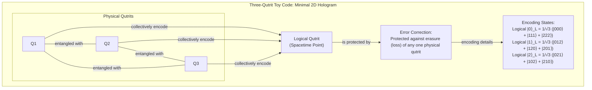
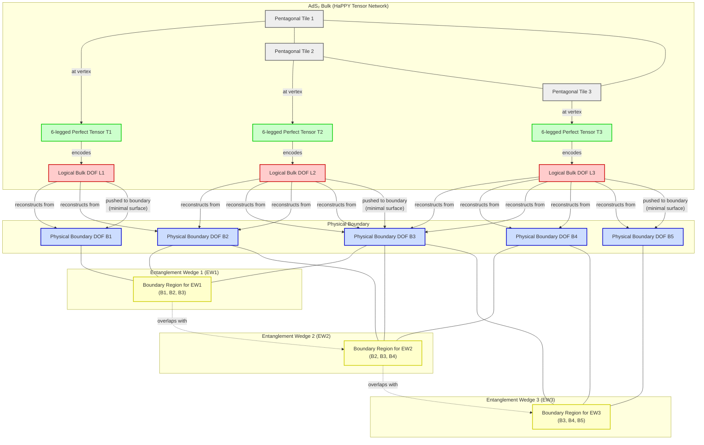

# How Space-Time Emerges from a Quantum Error-Correcting Code

In 1994, mathematician Peter Shor introduced an algorithm that shook the foundations of cryptography [[2]](). He showed that a "quantum computer," a then-hypothetical device, could factor large numbers exponentially faster than any classical machine, threatening to break much of modern digital security. This sparked immense excitement, but a fundamental obstacle stood in the way: the very quantum properties that made such a computer powerful also made it extremely fragile. The slightest environmental noise could corrupt its delicate state and destroy the computation.

For a time, it seemed scalable quantum computing might remain a theoretical fantasy. Then, in 1995, Shor delivered another breakthrough: a method for "quantum error correction" [[3]](). A year later, the threshold theorem confirmed that if the error rate of physical components could be kept below a certain limit, it was theoretically possible to build fault-tolerant quantum computers of any size [[1]](). This discovery convinced a generation of scientists that building a quantum computer was, as quantum computer scientist Scott Aaronson put it, "merely a staggering problem of engineering" [[17]]().

For nearly two decades, quantum error correction remained the specialized domain of physicists and computer scientists working to build these machines. Then, in 2014, a trio of young quantum gravity researchers—Ahmed Almheiri, Xi Dong, and Daniel Harlow—made an astonishing discovery. They found evidence that the universe itself might be using the same trick. Their calculations suggested that in certain theoretical universes, the very fabric of space-time emerges from a network of entangled particles according to the principles of a quantum error-correcting code [[26]]().

In this article, we will explore this deep and surprising connection. We will show you how the mathematical framework designed to protect fragile quantum computers also appears to be the principle that gives space-time its robustness. You will see how this holographic duality works, where it breaks down at the edge of black holes, and what this convergence of fields means for the future of both quantum gravity and quantum computing.

## The Quantum Computing Challenge and the Discovery of a Cosmic Connection

The initial excitement around Shor's 1994 factoring algorithm was tempered by a deep-seated skepticism about whether a quantum computer could ever be built [[2]](). The source of this skepticism lies in the fundamental difference between classical and quantum information. A classical computer uses bits, which are like tiny switches that can be either 0 or 1. An *n*-bit register can therefore store exactly one of 2<sup>n</sup> possible values at any given time.

A quantum computer, on the other hand, uses "qubits." A qubit can be in the state |0⟩, the state |1⟩, or a "superposition" of both at the same time. This means an *n*-qubit register can exist in a coherent superposition of all 2<sup>n</sup> basis states simultaneously. This property, known as quantum parallelism, is the source of a quantum computer's immense power. Shor's algorithm, for example, uses this parallelism to evaluate a function for many inputs at once, allowing it to find the period of that function and, from there, the factors of a large number [[17]]().

This power, however, comes at a great cost: fragility. The superposition of a qubit is a delicate state, held together by a web of "entanglement" with other qubits. This entanglement means their fates are linked; measuring one can instantly affect the others, no matter how far apart they are. This interconnectedness is essential for computation, but it is also easily broken. The slightest interaction with the environment—a stray magnetic field or a pulse of microwave radiation—can introduce errors. These errors come in two main forms: "bit-flips," which swap the probabilities of a qubit being |0⟩ or |1⟩, and "phase-flips," which invert the mathematical relationship between the two states.

Crucially, you cannot simply measure the qubits to check for these errors. The act of measurement forces a qubit to "choose" a definite state, either 0 or 1. This collapses the superposition and severs its entanglement with the rest of the system, destroying the quantum computation in the process. For years, it seemed that the noise would always win, and any large-scale quantum computation would dissolve into random errors long before it could finish.

This is why Shor’s 1995 discovery of quantum error correction (QEC) was so important [[3]](). He showed that it was possible to encode logical information non-locally across many physical qubits. This was followed by the threshold theorem, independently proven by researchers like Dorit Aharonov and Michael Ben-Or, which established that if the error rate for each physical operation is below a certain constant threshold, active error correction can suppress errors faster than they accumulate [[1]], [[4]](). This proved that scalable, fault-tolerant quantum computing was, in principle, possible. As Scott Aaronson noted, "This was the central discovery in the ’90s that convinced people that scalable quantum computing should be possible at all" [[17]](). The effort to design better codes to handle the high error rates of real qubits remains "one of the major thrusts of the field" [[17]]().

For years, this remained a central challenge in quantum engineering. Then, in 2014, Ahmed Almheiri, Xi Dong, and Daniel Harlow proposed a radical new idea. They were studying the AdS/CFT correspondence, a theory suggesting that a universe with gravity, like Anti-de Sitter (AdS) space, can be described as a hologram projected from a lower-dimensional quantum field theory (CFT) living on its boundary. Their calculations suggested that this holographic emergence of space-time works exactly like a quantum error-correcting code [[26]](). Their paper triggered a wave of activity in the quantum gravity community, with new codes being discovered that capture more properties of space-time [[17]]().

This connection provides a deep explanation for a question we rarely ask: why is space-time so robust? As theoretical physicist John Preskill of Caltech explains, "We’re not walking on eggshells to make sure we don’t make the geometry fall apart" [[16]](). The reason, he argues, is that the geometry of space-time is itself a form of protected, logical information. Small, local errors in the underlying quantum description correspond to correctable errors on the physical qubits, leaving the macroscopic geometry unchanged. "I think this connection with quantum error correction is the deepest explanation we have for why that’s the case," Preskill said [[16]]().

This discovery opened a two-way street of scientific inquiry. On one hand, the language of QEC provides a new framework for tackling deep puzzles in quantum gravity, particularly those surrounding black holes. On the other, the highly efficient codes seemingly implemented by nature could inspire new designs for practical quantum computers. "Space-time is a lot smarter than us," Almheiri noted. "The kind of quantum error-correcting code which is implemented in these constructions is a very efficient code" [[17]]().

To understand this profound link, we first need to look at how these codes work in a simpler setting. With the Almheiri-Dong-Harlow conjecture establishing that holographic space-time behaves as a quantum error-correcting code, we now examine the concrete mechanics of how such codes protect logical information in simple qubit systems. This will allow you to recognize the same mathematical signatures when they reappear in the bulk geometry of AdS.

## How Quantum Error-Correcting Codes Work

The core trick behind quantum error correction is to store information not in individual qubits, but in the patterns of entanglement among many. Instead of entrusting a single, fragile particle with a piece of information, a logical qubit is encoded across a larger set of physical qubits in a highly entangled state. This non-local encoding ensures that no single physical qubit holds any information about the logical state, making it resilient to local errors [[25]]().

A simple, instructive (though not fully practical) example is the three-qubit bit-flip code. This code protects a single logical qubit of information against bit-flip errors. The encoding is straightforward:
*   The logical state |0⟩<sub>L</sub> is encoded as three physical qubits all in the |0⟩ state, written as |000⟩.
*   The logical state |1⟩<sub>L</sub> is encoded as three physical qubits all in the |1⟩ state, written as |111⟩.

A general state of the logical qubit, α|0⟩<sub>L</sub> + β|1⟩<sub>L</sub>, becomes the entangled state α|000⟩ + β|111⟩ [[25]]().

Now, suppose one of the physical qubits accidentally flips. How can you detect and correct this error without measuring the qubits directly and collapsing the superposition? The solution involves "syndrome extraction." You introduce two extra "ancilla" qubits and use a quantum circuit to perform parity checks. One gate checks whether the first and second physical qubits are the same or different, and another gate checks the parity of the first and third. These measurements do not reveal the logical state itself, only the relationships between the physical qubits [[25]]().

There are four possible outcomes, or "syndromes":
*   **Both pairs match (syndrome 00):** No error has occurred. The state is still α|000⟩ + β|111⟩.
*   **First and second different, first and third different (syndrome 10):** The first qubit has flipped. The state is α|100⟩ + β|011⟩.
*   **First and second different, first and third same (syndrome 11):** The second qubit has flipped. The state is α|010⟩ + β|101⟩.
*   **First and second same, first and third different (syndrome 01):** The third qubit has flipped. The state is α|001⟩ + β|110⟩.

Each unique syndrome tells you exactly which qubit to fix by applying a corrective operation (another bit-flip) without ever disturbing the logical qubit's superposition. "Quantum error correction, to me, it’s like magic," Almheiri said [[17]]().

```mermaid
flowchart LR
  %% 1. Encoding Phase
  subgraph "Encoding"
    Q_initial["Initial Qubits<br/>Q0: (α|0⟩ + β|1⟩)<br/>Q1: |0⟩<br/>Q2: |0⟩"]
    CNOT_encode["Encoding CNOT Gates<br/>(Control Q0, Target Q1)<br/>(Control Q0, Target Q2)"]
    Q_encoded["Logical State<br/>(α|000⟩ + β|111⟩)"]
    Q_initial -- "entangle" --> CNOT_encode
    CNOT_encode -- "produces" --> Q_encoded
  end

  %% 2. Error Introduction (Conceptual)
  Q_encoded -- "potential error" --> Error["Bit-Flip Error<br/>(Pauli-X on Q0, Q1, or Q2)"]

  %% 3. Syndrome Extraction Phase
  subgraph "Syndrome Extraction"
    A_initial["Ancilla Qubits<br/>A1: |0⟩<br/>A2: |0⟩"]
    CNOT_syndrome["Parity Check CNOTs<br/>(Control Q0, Target A1)<br/>(Control Q1, Target A1)<br/>(Control Q1, Target A2)<br/>(Control Q2, Target A2)"]
    Measurements["Measure Ancillas<br/>(M1, M2)"]
    Syndrome{"Syndrome<br/>(M1M2)"}
    Error -- "qubits with error" --> CNOT_syndrome
    A_initial -- "used by" --> CNOT_syndrome
    CNOT_syndrome -- "yields" --> Measurements
    Measurements -- "extracts" --> Syndrome
  end

  %% 4. Recovery Phase
  subgraph "Recovery"
    Syndrome -- "00 (no flip)" --> Rec_None["No Correction"]
    Syndrome -- "10 (Q0 flip)" --> Rec_Q0["Apply Pauli-X to Q0"]
    Syndrome -- "11 (Q1 flip)" --> Rec_Q1["Apply Pauli-X to Q1"]
    Syndrome -- "01 (Q2 flip)" --> Rec_Q2["Apply Pauli-X to Q2"]
    
    Rec_None --> Q_corrected["Corrected Logical State<br/>(Superposition Preserved)"]
    Rec_Q0 --> Q_corrected
    Rec_Q1 --> Q_corrected
    Rec_Q2 --> Q_corrected
  end

  %% Emphasize preservation of superposition
  classDef important fill:#fff,stroke:#333,stroke-width:2px,class Q_corrected important
```
Image 1: A quantum circuit diagram illustrating the three-qubit bit-flip code, showing encoding, error introduction, syndrome extraction, and recovery.

While the three-qubit code only corrects bit-flips, more sophisticated codes like Peter Shor's 9-qubit code can correct for both bit-flips and phase-flips [[25]](). A crucial feature of the best QEC codes is that they can typically recover all the encoded information from just slightly more than half of the physical qubits, even if the rest are completely corrupted [[17]](). It was this "slightly more than half" property that served as a key clue for Almheiri, Dong, and Harlow, hinting that the way space-time is constructed in holography might be related to quantum error correction.

Equipped with the concrete mechanics of qubit-based codes, we now show you how the holographic principle implements precisely the same structure on a gravitational stage, with AdS geometry emerging from entangled boundary degrees of freedom.

## The Holographic Principle and Space-Time Emerges as a Quantum Error-Correcting Code

To understand the holographic connection, you first need to distinguish between two types of universes. Our universe appears to have a positive vacuum energy, causing it to expand. This geometry is known as de Sitter space. In contrast, anti-de Sitter (AdS) space has a negative vacuum energy, which gives it a hyperbolic geometry, famously visualized in M.C. Escher's *Circle Limit* woodcuts. In these designs, tessellated creatures shrink as they approach the circle's edge. Similarly, AdS space has a boundary at infinity, a feature that makes it an ideal theoretical "sandbox" for studying quantum gravity [[17]](), [[27]](). In 1997, physicist Juan Maldacena discovered the AdS/CFT correspondence, a duality suggesting that the curved space-time inside an AdS universe is a holographic projection of a quantum theory of particles living on its lower-dimensional, gravity-free boundary [[27]]().
Image 2: The hyperbolic geometry in M.C. Escher’s 1959 woodcut, Circle Limit III, is also a feature of anti-de Sitter space. (Image by M.C. Escher from [Wikipedia](https://en.wikipedia.org/wiki/Circle_Limit_III#/media/File:Escher_Circle_Limit_III.jpg))

It was while exploring this duality that Almheiri and his colleagues noticed a striking parallel to quantum error correction. They found that any point in the interior of AdS space could be reconstructed from just over half of the boundary degrees of freedom, mirroring the property of optimal QEC codes [[17]](). In their 2014 paper, they proposed a simple toy model to illustrate this: a 2D hologram built from three "qutrits" (quantum particles with three states) [[26]](). In this model, the entangled trio of qutrits, arranged on a circle, encodes a single logical qutrit, which corresponds to a single point of space-time at the circle's center. The code is constructed such that this central point is protected against the erasure of any one of the three physical qutrits, just as in the error-correcting example from the previous section [[23]]().


Image 3: A diagram illustrating the three-qutrit toy code as a minimal 2D hologram, showing the logical qutrit, physical qutrits, their entanglement, error correction, and encoding states.

Of course, a single point does not make a universe. In 2015, a team including Harlow, Preskill, Fernando Pastawski, and Beni Yoshida developed a more sophisticated model, the "HaPPY" code [[30]](). This code uses a network of "perfect tensors," which are maximally entangled across any bipartition of their indices. These tensors are placed on a hyperbolic tiling of pentagons, creating a discrete version of AdS geometry. As Stanford physicist Patrick Hayden described them, each tensor is like a "little Tinkertoy" representing a single point in space-time [[17]](). This approach draws inspiration from tensor networks in condensed matter physics, such as the Multiscale Entanglement Renormalization Ansatz (MERA), which also model holographic properties and provide a way to understand entanglement structure across different scales [[31]]().

In the HaPPY model, logical information in the bulk (the interior) can be reconstructed from different overlapping regions on the boundary. These reconstruction regions, called "entanglement wedges," are the holographic analogue of being able to recover a logical qubit from different subsets of physical qubits. The reconstruction is often described by a greedy algorithm, where the boundary is iteratively pushed inward, tile by tile, terminating at a minimal cut through the network—a discrete version of the celebrated Ryu-Takayanagi surface [[32]](). "That’s where the error-correcting property comes in," Hayden said [[17]]().

However, the very perfection that makes HaPPY codes excellent toy models for error correction also makes them unphysical representations of a CFT. The boundary states they produce lack the smoothly decaying correlation functions expected in critical systems; for instance, two-point functions between simple operators often vanish entirely because such operators correspond to correctable errors that reveal no logical information [[32]](). More advanced models, like hyperinvariant tensor networks, use non-perfect tensors to build codes that produce correct boundary correlations and exhibit a more realistic, state-dependent breakdown of reconstruction at the horizon [[32]](), [[33]]().


Image 4: A Mermaid diagram illustrating the HaPPY tensor-network code, demonstrating how pentagonal tiles reproduce AdS hyperbolic geometry and how overlapping entanglement wedges function.

The general lesson is that quantum error correction provides a powerful new way of thinking about how geometry emerges from entanglement. "Quantum error correction gives us a more general way of thinking about geometry in this code language," said Preskill. He believes this language "ought to be applicable, in my opinion, to more general situations"—including a de Sitter universe like our own [[16]]().

For now, researchers are sticking with AdS spaces, which are much simpler to study but share many key properties with our world, most importantly, the existence of black holes. "The most fundamental property of gravity is that there are black holes," said Daniel Harlow. "That’s what makes gravity different from all the other forces. That’s why quantum gravity is hard" [[17]](). The same QEC structure that protects smooth AdS geometry fails in the presence of black holes. We now examine this breakdown of correctability at horizons and the paradoxes it creates.

## Black Holes: Where Correctability Breaks Down

Black holes represent the ultimate frontier for any theory of quantum gravity, a place where the neat picture of holographic error correction begins to break down. The presence of a black hole is defined by what Patrick Hayden calls "the breakdown of correctability." He describes the event horizon as a "sink for your ignorance," a boundary beyond which information can no longer be reconstructed from local operators on the boundary [[17]](). Once something falls in, keeping track of it becomes exponentially difficult.

This leads directly to Stephen Hawking's famous information paradox. In 1974, Hawking showed that black holes radiate heat and eventually evaporate. His semiclassical calculation implied this "Hawking radiation" is thermal and carries no information about what fell in. If true, this means a pure quantum state (the infalling matter) would evolve into a mixed state (the thermal radiation), violating the principle of unitarity, a cornerstone of quantum mechanics. A complete theory of quantum gravity must explain how this information gets out [[17]]().

The paradox is sharpened by the "Page curve": to preserve unitarity, the entanglement entropy of the radiation must first rise and then fall as the black hole evaporates, a downturn Hawking's calculation missed [[34]](). Recent breakthroughs resolve this by introducing "quantum extremal surfaces." These surfaces account for quantum field entanglement and, at late times, reveal a region inside the black hole called an "island." Including this island in the entropy calculation correctly reproduces the Page curve, showing how information escapes [[35]]().

The AdS/CFT correspondence simplifies the problem, as the boundary is dual to everything in the interior, including black holes. This guarantees information is never truly lost; it is always encoded on the boundary. However, the QEC properties change drastically. To reconstruct information from inside a black hole, one needs access to not just over half, but roughly three-quarters of the boundary qubits [[18]](). "Slightly more than half is not sufficient anymore," explained Almheiri, adding that why this specific fraction appears "is still an open question" [[17]]().

This tension came to a head in 2012 with the "firewall paradox," proposed by Almheiri and his collaborators [[28]](). They argued a contradiction arises from the monogamy of entanglement: a quantum system cannot be maximally entangled with two others. For a smooth horizon, a late-time Hawking particle must be entangled with its partner inside. But for information to escape, it must also be entangled with early radiation. This violation implies something must give, leading to their proposal of a violent "firewall" of high-energy particles at the horizon that would destroy any infalling observer [[28]]().

Quantum error correction offers a way to resolve this paradox and preserve a smooth horizon. The key insight is that the entanglement between the interior and the radiation can be viewed as a geometric connection, a tiny wormhole, an idea encapsulated in the slogan "ER=EPR". In this picture, QEC protects the delicate entanglement that holds the wormhole's geometry together, allowing information to escape without a violent firewall. Almheiri reported in a 2018 paper that QEC is "essential for maintaining the smoothness of space-time at the horizon" of a wormhole [[29]](). He speculates that this mechanism is how qubits escape a black hole after falling in, thereby resolving Hawking's paradox [[17]]().

## Implications for Our Universe and Quantum Computing

The deep connection between space-time and quantum error correction is not just a theoretical curiosity. It has sparked research with potentially practical implications. The U.S. Department of Defense is funding research into holographic codes, hoping that their geometric structure might lead to more efficient and robust error-correction schemes for future quantum computers [[17]]().

On the physics side, the biggest challenge is lifting these ideas to a realistic description of our own universe. Unlike AdS space, our de Sitter universe has a positive cosmological constant and lacks a stable spatial boundary where a dual quantum theory can be defined [[36]](). "The whole connection is known for a world that is manifestly not our world," Aaronson commented [[16]](). Despite these obstacles, research is pushing forward. Some novel approaches propose using non-unitary tensor networks, which can generate an emergent de Sitter geometry from the entanglement structure of non-Hermitian quantum systems, offering a new bottom-up path toward dS/CFT [[37]]().

Despite these challenges, the central lesson remains powerful. The language of quantum error correction has provided a new lens through which to view the emergence of geometry itself. It suggests that entanglement is not just a strange quantum correlation but the fundamental "glue" holding the universe together. As John Preskill eloquently summarized, "It’s really entanglement which is holding the space together. If you want to weave space-time together out of little pieces, you have to entangle them in the right way. And the right way is to build a quantum error-correcting code" [[17]]().

## Conclusion

We have journeyed from the pragmatic challenge of building a quantum computer to the deepest questions about the nature of space-time and gravity. What began as a mathematical trick to protect fragile qubits from noise has revealed itself to be a fundamental principle woven into the fabric of the cosmos. The discovery that holographic universes behave like quantum error-correcting codes has provided a powerful new language for understanding how smooth, stable geometry can emerge from the chaotic quantum world.

This convergence of quantum information theory and quantum gravity is reshaping both fields. For physicists, it offers a concrete framework for tackling the paradoxes of black holes and the mystery of emergent space-time. For computer scientists, it offers inspiration from nature's own highly efficient error-correction schemes. The road ahead is long, particularly in bridging the gap from theoretical AdS models to our own de Sitter universe. Yet, the unexpected unity between the code of computation and the code of reality marks a profound step forward in our quest to understand the universe's deepest secrets.

## References

- [1] D. Aharonov & M. Ben-Or. (1996). Fault-Tolerant Quantum Computation With Constant Error. (https://arxiv.org/abs/quant-ph/9611025)
- [2] P. W. Shor. (1995). Polynomial-Time Algorithms for Prime Factorization and Discrete Logarithms on a Quantum Computer. (https://arxiv.org/pdf/quant-ph/9508027.pdf)
- [3] P. W. Shor. (1995). Scheme for reducing decoherence in quantum computer memory. (https://journals.aps.org/pra/abstract/10.1103/PhysRevA.52.R2493)
- [4] D. Aharonov & M. Ben-Or. (2008). Fault-Tolerant Quantum Computation with Constant Error Rate. (https://epubs.siam.org/doi/10.1137/S0097539799359385)
- [5] E. Knill, R. Laflamme, & W. H. Zurek. (1998). Resilient Quantum Computation. (https://www.science.org/doi/10.1126/science.279.5349.342)
- [6] A. Y. Kitaev. (2003). Fault-tolerant quantum computation by anyons. (http://www.sciencedirect.com/science/article/pii/S0003491602000180)
- [7] P. W. Shor. (1996). Fault-tolerant quantum computation. (https://doi.org/10.1109%2FSFCS.1996.548464)
- [8] S. Aaronson. (2006). Quantum Computing Since Democritus. (https://www.scottaaronson.com/democritus/lec14.html)
- [9] A. G. Fowler, A. M. Stephens, & P. Groszkowski. (2009). High-threshold universal quantum computation on the surface code. (https://doi.org/10.1103%2Fphysreva.80.052312)
- [10] E. T. Campbell, B. M. Terhal, & C. Vuillot. (2017). Roads towards fault-tolerant universal quantum computation. (https://doi.org/10.1038%2Fnature23460)
- [11] F. Pastawski, B. Yoshida, D. Harlow, & J. Preskill. (2015). Holographic quantum error-correcting codes: toy models for the bulk/boundary correspondence. (https://doi.org/10.1007%2Fjhep06(2015)149)
- [12] A. Almheiri, X. Dong, & D. Harlow. (2015). Bulk Locality and Quantum Error Correction in AdS/CFT. (https://arxiv.org/abs/1411.7041)
- [13] A. Almheiri. (2018). Holographic Quantum Error Correction and the Projected Black Hole Interior. (https://arxiv.org/abs/1810.02055)
- [14] X. Dong, E. Silverstein, & G. Torroba. (2018). De Sitter Holography and Entanglement Entropy. (https://link.springer.com/article/10.1007%2FJHEP07%282018%29050)
- [15] U.S. Department of Defense. (2019). FY 2019 Defense Multidisciplinary Research Program of the University Research Initiative (MURI). (https://grantbulletin.research.uiowa.edu/fy-2019-defense-multidisciplinary-research-program-university-research-initiative-muri-white-paper)
- [16] N. Wolchover. (2019). How Space and Time Could Be a Quantum Error-Correcting Code. (https://www.quantamagazine.org/how-space-and-time-could-be-a-quantum-error-correcting-code-20190103)
- [17] N. Wolchover. (2019). How Space and Time Could Be a Quantum Error-Correcting Code. (https://www.quantamagazine.org/how-space-and-time-could-be-a-quantum-error-correcting-code-20190103/)
- [18] A. Almheiri, X. Dong, & D. Harlow. (2015). Bulk Locality and Quantum Error Correction in AdS/CFT. (https://indico.ift.uam-csic.es/event/9/attachments/26/36/Wall_Black_Hole_Thermodynamics.pdf)
- [19] A. Almheiri, X. Dong, & D. Harlow. (2015). Bulk locality and quantum error correction in AdS/CFT. (https://www.osti.gov/pages/biblio/1803745)
- [20] A. Almheiri, X. Dong, & D. Harlow. (2015). Bulk locality and quantum error correction in AdS/CFT. (https://www2.yukawa.kyoto-u.ac.jp/~extremeuniverse/wpsite/wp-content/uploads/2022/10/KyotoOct2022.pdf)
- [21] A. Almheiri, D. Marolf, J. Polchinski, & J. Sully. (2013). Black Holes: Complementarity or Firewalls?. (https://arxiv.org/html/2507.06046v1)
- [22] R. Cleve, D. Gottesman, & H.-K. Lo. (1999). How to Share a Quantum Secret. (https://ncatlab.org/nlab/show/quantum+error+correction)
- [23] Error Correction Zoo. (n.d.). Three-qutrit code. (https://errorcorrectionzoo.org/list/holographic)
- [24] J. Bain. (n.d.). Spacetime as a Quantum Error-Correcting Code. (https://research.engineering.nyu.edu/~jbain/Talks/ST_QECC.pdf)
- [25] R. S. Artur, J. Eisert, & D. Gross. (2020). Lecture 13: Quantum Error Correction. (https://www.cl.cam.ac.uk/teaching/1920/QuantComp/Quantum_Computing_Lecture_13.pdf)
- [26] A. Almheiri, X. Dong, & D. Harlow. (2014). Bulk Locality and Quantum Error Correction in AdS/CFT. (https://arxiv.org/abs/1411.7041)
- [27] E. Driscoll. (2018). Albert Einstein, Holograms and Quantum Gravity. (https://www.youtube.com/watch?v=IIHucC-HPz0)
- [28] A. Almheiri, D. Marolf, J. Polchinski, & J. Sully. (2012). Black Holes: Complementarity or Firewalls?. (https://arxiv.org/abs/1207.3123)
- [29] A. Almheiri. (2018). Holographic Quantum Error Correction and the Projected Black Hole Interior. (https://arxiv.org/abs/1810.02055)
- [30] F. Pastawski, B. Yoshida, D. Harlow, & J. Preskill. (2015). Holographic quantum error-correcting codes: toy models for the bulk/boundary correspondence. (https://arxiv.org/abs/1503.06237)
- [31] How tensor networks from condensed matter physics inspire holographic quantum error correction. (https://ar5iv.labs.arxiv.org/html/2102.02619)
- [32] M. Steinberg, S. Feld, & A. Jahn. (2023). Holographic codes from hyperinvariant tensor networks. (https://www.nature.com/articles/s41467-023-42743-z)
- [33] M. Steinberg, et al. (2024). Far from Perfect: Quantum Error Correction with (Hyperinvariant) Evenbly Codes. (https://arxiv.org/html/2407.11926v2)
- [34] Black hole information paradox. (https://en.wikipedia.org/wiki/Black_hole_information_paradox)
- [35] Quantum Extremal Surfaces. (https://adscft.org/black-hole-information/holographic-entropy/quantum-extremal-surfaces)
- [36] R. Monten. (2022). Aspects of de Sitter holography. (https://fys.kuleuven.be/itf/groups/hep/files/phd/ruben-monten-thesis-public.pdf)
- [37] K. Chou & P. Chang. (2024). Emergent de Sitter Space and Non-Unitary Tensor Networks from Non-Hermitian Quantum Criticality. (https://arxiv.org/html/2606.17983v1)