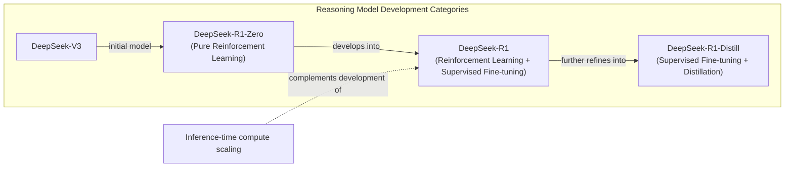

# 2025 AI Research Update: 14 Papers on Inference-Time Compute Scaling

In 2025, building AI agents that can reliably solve complex, multi-step problems is a top priority. The direct-answer LLMs we started with are no longer enough for the sophisticated, agentic systems we build today. This has sparked a surge in research focused on enhancing LLM reasoning, particularly since the release of models like DeepSeek-R1. The field is rapidly exploring a blend of techniques, including inference-time scaling, pure reinforcement learning (RL), RL-SFT hybrids, and distillation.

This article provides a comprehensive survey of this fast-moving landscape, focusing on 14 recent papers that explore different ways to scale an LLM’s compute at inference time. We will look at how these methods allow models to "think longer" and achieve better performance without changing their underlying weights.
Image 1: The four main categories of implementing reasoning models. This article focuses on inference-time-scaling methods. (Source [magazine.sebastianraschka.com](https://magazine.sebastianraschka.com/p/understanding-reasoning-llms))

To understand where inference-time scaling fits, we first need to map out the four main categories of reasoning model development.

## Implementing and improving reasoning in LLMs: The four main categories

Reasoning models are a specialized class of LLMs designed to tackle problems that require intermediate steps, such as puzzles, math proofs, or complex coding challenges. Unlike standard LLMs that often provide a direct, single-pass answer, reasoning models generate a "thought process," either internally or as part of their explicit output. This mimics a more deliberate, human-like approach to problem-solving [[2]](https://magazine.sebastianraschka.com/p/understanding-reasoning-llms).
Image 2: A plain response versus a response with intermediate reasoning steps. (Source [magazine.sebastianraschka.com](https://magazine.sebastianraschka.com/p/understanding-reasoning-llms))

There are two fundamental ways to improve an LLM's reasoning capabilities: increasing training compute or increasing inference compute. Increasing training compute involves modifying the model's weights through methods like reinforcement learning (RL) or supervised fine-tuning (SFT). This is a permanent change to the model itself. In contrast, increasing inference compute involves allocating more computational resources (FLOPs) at test time to improve output quality, without altering the model's weights. The simplest example of this is chain-of-thought (CoT) prompting, where adding "Let's think step by step" makes the model generate more tokens, thereby using more compute to arrive at an answer [[1]](https://arxiv.org/abs/2205.11916).

In practice, the best-performing systems often combine both approaches. Relying solely on training can lead to issues like "reward hacking," where a model learns to exploit the reward function without genuinely improving its reasoning. On the other hand, pure inference-time scaling on a weak base model yields limited gains. A well-trained model provides a strong foundation, which can then be further enhanced at inference time.
Image 3: Performance improvements from parallel sampling depend on temperature and the number of samples. (Source [arxiv.org](https://arxiv.org/abs/2502.14382))

The development of reasoning models generally falls into four main categories, as outlined by Sebastian Raschka [[2]](https://magazine.sebastianraschka.com/p/understanding-reasoning-llms). These categories show a progression from applying test-time techniques to existing models to creating highly specialized models through intensive training.

Image 4: The four core categories of reasoning model development and their relationships within the DeepSeek R1 pipeline.

**1. Inference-time compute scaling.** This is the most straightforward approach. It involves using techniques like CoT prompting, majority voting, or search algorithms to make an existing LLM "think" more at inference time. These methods do not require any changes to the model's weights. While OpenAI’s o1 models are rumored to use this heavily, the DeepSeek R1 paper noted that many explicit inference-time methods they tried were "unsuccessful attempts." However, their training process did result in an implicit form of inference scaling, as the model learned to generate longer, more detailed responses, which naturally increases inference costs [[2]](https://magazine.sebastianraschka.com/p/understanding-reasoning-llms). This highlights that even models not explicitly designed for inference-time scaling can benefit from it, albeit in a less controlled manner.

**2. Pure reinforcement learning (RL).** This approach, exemplified by DeepSeek-R1-Zero, involves training a base model using only RL. The model is rewarded for correct final answers, without being shown human-annotated reasoning steps. This allows the model to discover its own reasoning pathways. The DeepSeek team found that this "cold start" method was enough for reasoning abilities to emerge, though it presented challenges like poor readability and language mixing [[3]](https://arxiv.org/abs/2501.12948). The key insight here is that reasoning can be an emergent behavior incentivized by outcome-based rewards, rather than something that must be explicitly taught through supervised examples. This method is research-intensive but offers a path to discovering novel, non-human-like reasoning strategies.

**3. Reinforcement learning and supervised fine-tuning (RL + SFT).** This is the approach used to build flagship reasoning models like DeepSeek-R1. It starts with a model trained via pure RL (like R1-Zero) and then refines it with additional SFT and RL stages. The SFT data often includes chain-of-thought examples, and the RL stages use a mix of rule-based rewards (for tasks like math and coding) and human preference-based rewards. This hybrid approach produces high-performance reasoning models by combining the exploratory power of RL with the alignment and stylistic control of SFT [[2]](https://magazine.sebastianraschka.com/p/understanding-reasoning-llms). It represents the current state-of-the-art for building top-tier reasoning models.

**4. Supervised fine-tuning and model distillation.** This category involves training smaller, more efficient models on the outputs of a larger, more powerful reasoning model. This is not "distillation" in the classic sense of mimicking logits, but rather a form of instruction fine-tuning on a high-quality, machine-generated dataset. The DeepSeek-R1-Distill models were created this way, using SFT data generated by DeepSeek-R1. This approach is effective for creating smaller models with strong reasoning capabilities, though their performance is ultimately limited by the teacher model [[2]](https://magazine.sebastianraschka.com/p/understanding-reasoning-llms). It is a pragmatic choice for deploying reasoning capabilities in resource-constrained environments.
Image 5: The four main approaches for building reasoning models. (Source [magazine.sebastianraschka.com](https://magazine.sebastianraschka.com/p/understanding-reasoning-llms))

With these four categories mapped out, we can now zoom in on the first one: inference-time compute scaling, which is the focus of this article.

## Inference-time compute scaling methods

The core idea behind inference-time compute scaling is simple: giving a model more time to "think" can lead to better answers, much like how humans benefit from spending more time on difficult problems. The most basic way to achieve this is through prompt engineering.

Classic chain-of-thought (CoT) prompting, using phrases like "Let's think step by step," encourages the model to generate intermediate reasoning steps before giving a final answer. This process naturally increases the number of tokens generated, which in turn increases latency and cost, but often leads to more accurate results on complex problems [[1]](https://arxiv.org/abs/2205.11916). While effective, this approach is just the tip of the iceberg.
Image 6: An example of classic CoT prompting from the "Large Language Models are Zero-Shot Reasoners" paper. (Source [arxiv.org](https://arxiv.org/abs/2205.11916))

Beyond simple prompting, more advanced techniques involve search and voting strategies. For example, in **majority voting**, the model generates multiple answers, and the most frequent one is chosen. This is a form of parallel scaling. **Beam search**, on the other hand, is a sequential method that explores multiple potential reasoning paths at each step, pruning the less promising ones. These search algorithms are often guided by a process reward model (PRM), which scores the quality of each intermediate step, helping the model stay on the right track [[4]](https://arxiv.org/abs/2408.03314). These methods offer more structured ways to explore the solution space, moving beyond a single, linear chain of thought.
Image 7: Different search-based methods that rely on a process-reward-based model to select the best answer. (Source [arxiv.org](https://arxiv.org/abs/2408.03314))

These methods represent the foundational approaches to inference-time scaling. Now, let's examine a recent paper that combines some of these ideas in a simple yet effective way.

## s1: Simple test-time scaling

The paper "[s1: Simple Test-Time Scaling](https://arxiv.org/abs/2501.19393)" (31 Jan, 2025) introduces a straightforward yet powerful hybrid approach to enhance LLM reasoning. Instead of relying on complex reinforcement learning or massive datasets, the authors combine a small, carefully curated SFT dataset of 1,000 reasoning traces with a simple inference-time technique called "budget forcing" [[5]](https://medium.com/@jdegange85/paper-review-of-s1-simple-test-time-scaling-6094eff9c1e8), [[6]](https://huggingface.co/papers/2501.19393). This method stands out for its simplicity and sample efficiency.

The core mechanism of budget forcing is to control the length of the model's "thinking" process. If the model tries to stop reasoning too early, the system suppresses the end-of-thinking token and instead appends a "Wait" token. This simple intervention encourages the model to pause, re-evaluate its current reasoning path, and potentially self-correct. This is a form of sequential scaling, as it extends the reasoning chain one step at a time. The authors found that the "Wait" token was more effective than more neutral phrases like "Hmm," suggesting that it induces a sense of doubt that triggers active reconsideration rather than just passive time extension [[6]](https://huggingface.co/papers/2501.19393). This is reminiscent of the "Aha moment" observed during the training of DeepSeek-R1, where the model began to use words like "wait" to signal a shift in its reasoning process [[3]](https://arxiv.org/abs/2501.12948).
Image 8: Illustration of "wait" token insertion to control the length of the output. (Source [arxiv.org](https://arxiv.org/abs/2501.19393))

Empirically, the paper shows a clear correlation between the length of the generated response and the accuracy on reasoning benchmarks. By using budget forcing to extend the thinking time, the model's performance on tasks like AIME24 improved from 50% to 57%. This demonstrates that even a simple, non-RL-based method can achieve effective test-time scaling. The paper's s1K dataset was curated based on three principles: quality, difficulty (selecting problems that smaller models fail on), and diversity (sampling across different mathematical domains). Ablations showed that all three criteria were crucial; datasets built on only one or two of these principles performed significantly worse.
Image 9: The correlation between response accuracy and length. (Source [arxiv.org](https://arxiv.org/abs/2501.19393))

However, the authors also acknowledge the limitations of this approach. The performance gains from budget forcing eventually flatten out, as simply extending the reasoning chain can lead to repetitive loops rather than continued progress. They call for future work to compare their method against more sophisticated techniques like beam search, lookahead search, and compute-optimal search.
Image 10: Performance comparison between "Wait" and "Hmm" tokens. (Source [arxiv.org](https://arxiv.org/abs/2501.19393))

## Other noteworthy research papers on inference-time compute scaling

The release of models like o1 and DeepSeek-R1 has led to a flood of research on inference-time compute scaling. The following sections provide brief summaries of several noteworthy papers, each offering a unique approach to this problem. We have kept these summaries concise to cover a broad range of techniques without getting bogged down in repetitive details.

A common theme you will notice is that many of these methods are not purely prompt-based. They often involve some form of training or fine-tuning to work in conjunction with the inference-time strategy. This distinguishes them from simple distillation or SFT approaches that just happen to produce longer outputs. These are regulated approaches, where the amount of compute used at inference time is actively controlled, allowing for a more deliberate and efficient use of resources.

### Test-Time Preference Optimization

"Test-Time Preference Optimization" introduces an iterative, on-the-fly alignment process that improves model outputs without changing the underlying weights, making it a pure inference-time method [[7]](https://icml.cc/virtual/2025/poster/46149), [[8]](https://proceedings.mlr.press/v267/li25ac.html). The process works in a four-step loop. First, the model generates multiple responses to a query. A separate reward model then scores these responses, selecting the best ("chosen") and worst ("rejected") ones. The policy model then generates textual critiques, analyzing the strengths of the chosen response and the weaknesses of the rejected one. Finally, these critiques are used to generate suggestions for improvement, which guide the model in creating a new, refined set of responses for the next iteration. This cycle repeats, progressively aligning the output with the reward model's preferences.
Image 11: The Test-Time Preference Optimization process. (Source [arxiv.org](https://arxiv.org/abs/2501.12895))

### Thoughts Are All Over the Place

The paper "[Thoughts Are All Over the Place: On the Underthinking of o1-Like LLMs](https://arxiv.org/abs/2501.18585)" identifies a phenomenon called "underthinking" in reasoning models [[9]](https://www.linkedin.com/pulse/thoughts-all-over-place-underthinking-o1-like-llms-vlad-bogolin-rhnme), [[10]](https://tldr.takara.ai/p/2501.18585). This is where models frequently switch between different reasoning paths without sufficiently exploring any single one, leading to lower accuracy. To address this, the authors propose the **Thought Switching Penalty (TIP)**. This is a decoding strategy that applies a penalty to the logits of tokens associated with thought transitions (like "alternatively" or "another way is"). By discouraging the model from prematurely switching paths, TIP forces a deeper exploration of each line of reasoning. This is a pure inference-time technique that improves accuracy on challenging benchmarks without requiring any model fine-tuning.
Image 12: A visualization of the Thought Switching Penalty method. (Source [arxiv.org](https://arxiv.org/abs/2501.18585))

### Trading Inference-Time Compute for Adversarial Robustness

The paper "[Trading Inference-Time Compute for Adversarial Robustness](https://arxiv.org/abs/2501.18841)" explores the relationship between inference-time compute and a model's resilience to adversarial attacks [[11]](https://cdn.openai.com/papers/trading-inference-time-compute-for-adversarial-robustness-20250121_1.pdf), [[12]](https://openai.com/index/trading-inference-time-compute-for-adversarial-robustness), [[13]](https://huggingface.co/papers/2501.18841). The authors find that simply allowing a model to "think longer" generally reduces the success rate of attacks, even without any specific adversarial training. The paper presents empirical trade-off curves showing that as inference compute increases, attack success often tends to zero.

However, this is not a silver bullet. The gains are limited in cases of policy ambiguity, where an attacker can exploit loopholes in the model's safety guidelines. The paper also introduces two novel attack strategies that specifically target reasoning models: **Think Less**, which tries to trick the model into reducing its own computation, and **Nerd Sniping**, which traps the model in unproductive thinking loops. The key takeaway is that while scaling inference compute is a valuable defense, it is not a complete solution for LLM safety.
Image 13: Analysis from "Trading Inference-Time Compute for Adversarial Robustness." (Source [arxiv.org](https://arxiv.org/abs/2501.18841))

### Chain-of-Associated-Thoughts

"[CoAT: Chain-of-Associated-Thoughts Framework for Enhancing Large Language Models Reasoning](https://arxiv.org/abs/2502.02390)" introduces a framework that combines Monte Carlo Tree Search (MCTS)—a technique known for balancing exploration and exploitation in game AI like AlphaGo—with what the authors call an "associative memory" [[14]](https://arxiv.org/html/2502.02390v3), [[15]](https://www.turingpost.com/p/testtimescaling2), [[16]](https://openreview.net/forum?id=h6CQPEYAVp). This memory acts as a dynamic knowledge base during inference, allowing the model to revisit and refine earlier parts of its reasoning path. As the MCTS explores different reasoning pathways, the associative memory helps the model incorporate newly generated information without losing the broader context. This synergy between structured search and adaptive memory enables a more systematic and coherent exploration of the solution space at test time.
Image 14: A visualization of the CoAT framework. (Source [arxiv.org](https://arxiv.org/abs/2502.02390))

### Step Back to Leap Forward

The paper "[Step Back to Leap Forward: Self-Backtracking for Boosting Reasoning of Language Models](https://arxiv.org/abs/2502.0440)" proposes a self-backtracking mechanism that teaches models to recognize and correct their own mistakes [[17]](https://arxiv.org/html/2502.04404v1), [[18]](https://ojs.aaai.org/index.php/AAAI/article/view/39986/43947). During a special training phase, the model learns to generate a `<backtrack>` token when it identifies a suboptimal reasoning path. This learned ability is then leveraged at inference time through a tree-based search algorithm. When the model generates the backtrack token, the search algorithm revisits an earlier state and explores an alternative path.

A key advantage of this approach is that it internalizes the state evaluation process, removing the need for an external process reward model, which is a common component in other search-based methods. The model can dynamically adjust its search depth and breadth based on its own learned backtracking skill. The results from this "slow thinking" search process can then be used to further fine-tune the model, creating a self-improvement loop that transfers the benefits of slow, deliberate reasoning to a faster, single-pass model.
Image 15: The Self-Backtracking mechanism, showing training, inference, and self-improvement phases. (Source [arxiv.org](https://arxiv.org/abs/2502.0440))

### Scaling up Test-Time Compute with Latent Reasoning

The paper "[Scaling Test-Time Compute: How Recurrent Depth Transforms AI Reasoning](https://medium.com/@sahin.samia/scaling-test-time-compute-how-recurrent-depth-transforms-ai-reasoning-fa866fa968db)" explores an architecture that scales compute by iterating in the model's latent space, not by generating more tokens [[19]](https://huggingface.co/papers/2502.05171), [[20]](https://openreview.net/forum?id=S3GhJooWIC), [[21]](https://neurips.cc/virtual/2025/poster/117966), [[22]](https://icml.cc/virtual/2025/51856), [[23]](https://medium.com/@sahin.samia/scaling-test-time-compute-how-recurrent-depth-transforms-ai-reasoning-fa866fa968db). A recurrent block is unrolled to a variable depth, representing a trade-off: sacrificing the high parallelizability of standard transformers for a more expressive forward pass [[24]](https://www.lesswrong.com/posts/pLnLSgWphqDbdorgi/on-recent-results-in-llm-latent-reasoning). The major drawback is opacity. Without explicit reasoning steps, the process is hard to debug and inherits a classic RNN issue: it must compress all intermediate results onto a fixed-length "scratchpad" [[24]](https://www.lesswrong.com/posts/pLnLSgWphqDbdorgi/on-recent-results-in-llm-latent-reasoning). Some research even suggests these latent steps are often underutilized by the model [[25]](https://arxiv.org/html/2604.04902v1).
Image 16: A visualization of the recurrent depth approach. (Source [arxiv.org](https://arxiv.org/abs/2502.05171))

### Can a 1B LLM Surpass a 405B LLM?

The paper "[Can 1B LLM Surpass 405B LLM? Rethinking Compute-Optimal Test-Time Scaling](https://arxiv.org/abs/2502.06703)" conducts a systematic study of the complex interactions between inference-time scaling methods, process reward models (PRMs), and problem difficulty. The authors propose a "compute-optimal" scaling strategy that adapts the inference budget and method based on the specific policy model, the PRM being used, and the complexity of the task at hand.

Their key finding is that a small model can outperform a much larger one if the inference-time compute is allocated optimally. For example, they show that a 1B parameter model, when paired with the right scaling strategy, can achieve higher accuracy on the MATH-500 benchmark than an unscaled 405B Llama 3 model. This has significant implications for AI engineers, as it suggests that intelligently managing inference compute can be a more efficient path to high performance than simply using a larger, more expensive model.
Image 17: A comparison of compute-optimal scaling strategies. (Source [arxiv.org](https://arxiv.org/abs/2502.06703))

### Learning to Reason from Feedback at Test-Time

Some emerging research explores hybrid approaches that blur the line between pure inference-time scaling and traditional training. One such conceptual method involves updating the model's weights directly at inference time. This is a departure from techniques that either keep weights frozen or only modify the input prompt.

An example of such a method would be an optimizer, let's call it "OpTune," that adjusts a small subset of the model's weights based on feedback from previous mistakes within the same inference session. Instead of storing failed attempts in the growing prompt context, this approach would "remember" errors through these lightweight weight updates. The benefit is clear: the model could learn from its errors without being constrained by a finite context window. While this specific approach is not detailed in the provided research, it represents a fascinating and challenging direction for future work.
Image 18: A conceptual visualization of an optimizer that updates weights at test-time. (Source [www.arxiv.org](https://www.arxiv.org/abs/2502.12521))

### Inference-Time Computations for LLM Reasoning and Planning

The paper "[Inference-Time Computations for LLM Reasoning and Planning: A Benchmark and Insights](https://www.arxiv.org/abs/2502.12521)" introduces **Sys2Bench**, a comprehensive benchmark for evaluating inference-time techniques across a wide range of reasoning and planning tasks [[26]](https://github.com/usail-hkust/benchmark_inference_time_computation_LLM). The benchmark covers five categories: arithmetic, logical, commonsense, and algorithmic reasoning, as well as planning domains. The authors evaluate various techniques, including CoT, Tree-of-Thought, and Reasoning as Planning.

The key insight from this work is that no single inference-time technique consistently performs best across all task types. For example, while search-based methods might excel at algorithmic reasoning, they may underperform on commonsense tasks. This forces engineers to move away from a one-size-fits-all approach and instead match the right inference method to the specific domain of their application. The paper also provides a valuable analysis of the trade-offs between computational cost and performance gains for each technique.
Image 19: Results from the Sys2Bench benchmark. (Source [arxiv.org](https://www.arxiv.org/abs/2502.12521))

### Inner Thinking Transformer

The "[Inner Thinking Transformer](https://arxiv.org/abs/2502.13842)" introduces a novel architecture that implements dynamic depth scaling, moving away from the fixed number of transformer layers used in standard models [[27]](https://aclanthology.org/2025.acl-long.1369.pdf), [[28]](https://arxiv.org/pdf/2502.13842), [[29]](https://arxiv.org/html/2502.13842v1), [[30]](https://www.emergentmind.com/topics/inner-thinking-transformer-itt). The core mechanism is **Adaptive Token Routing**, which identifies "difficult" tokens and sends them through the same transformer layer multiple times for deeper processing. This selectively increases the inference compute budget for only the parts of the input that require more complex reasoning. The result is a more efficient allocation of "thinking" effort, as the model can focus its computational resources exactly where they are needed most, all without lengthening the final output sequence.
Image 20: The Adaptive Token Routing mechanism of the Inner Thinking Transformer. (Source [arxiv.org](https://arxiv.org/abs/2502.13842))

### Test Time Scaling for Code Generation

The paper "[S\*: Test Time Scaling for Code Generation](https://arxiv.org/abs/2502.14382)" proposes a hybrid framework called **S\*** that is specifically designed to improve code generation. Unlike mathematical reasoning, where correctness can often be checked with string matching, code requires execution against test cases to verify its functionality. S\* leverages this unique property of the coding domain.
Image 21: An overview of the S\* framework for code generation. (Source [arxiv.org](https://arxiv.org/abs/2502.14382))

The framework operates in two stages. First, in the **generation stage**, it combines parallel sampling of multiple code solutions with sequential scaling through iterative debugging. Each generated sample is executed against public test cases, and the outputs and error messages are fed back to the model to refine the code. This process repeats until a solution passes all public tests or a maximum number of revisions is reached. This sequential refinement improves the overall quality and correctness of the candidate pool.

The second stage is **selection**. Since multiple candidate solutions might pass the public tests, a more robust method is needed to choose the best one. S\* introduces **adaptive input synthesis**, where for each pair of passing solutions, an LLM is prompted to generate a new, "distinguishing" test input that is likely to make one of them fail. These new inputs are then executed, and the model that passes is selected. This adaptive, execution-grounded approach provides a more reliable way to identify the truly correct solution compared to relying on a model's internal judgment or randomly generated tests. This idea is connected to earlier research from Google on compute-optimal test-time scaling, which also emphasized adapting the evaluation based on the specific problem.

### Chain of Draft

The paper "[Chain of Draft: Thinking Faster by Writing Less](https://arxiv.org/abs/2502.18600)" makes a simple but powerful observation: when humans solve problems, they often jot down concise notes or "drafts" rather than writing out full, verbose, step-by-step explanations [[31]](https://www.helicone.ai/blog/chain-of-draft), [[32]](https://www.analyticsvidhya.com/blog/2025/03/chain-of-draft), [[33]](https://medium.com/data-science-in-your-pocket/what-is-chain-of-drafts-bye-bye-chain-of-thoughts-76658d913169), [[34]](https://aws.amazon.com/blogs/machine-learning/move-beyond-chain-of-thought-with-chain-of-draft-on-amazon-bedrock), [[35]](https://arxiv.org/html/2502.18600v1). Inspired by this, the authors propose **Chain of Draft (CoD) prompting**. This technique instructs the model to generate minimal yet informative intermediate steps, often limiting each step to just a few words or a mathematical equation.
Image 22: A comparison of standard, Chain-of-Thought, and Chain-of-Draft prompting. (Source [arxiv.org](https://arxiv.org/abs/2502.18600))

The results are impressive. On various reasoning benchmarks, CoD achieves accuracy comparable to or even better than standard CoT, while drastically reducing the number of tokens generated—in some cases by up to 92%. This leads to significant savings in both cost and latency. The main trade-off is the loss of human-readable, natural-language reasoning traces. This makes CoD an excellent choice for engineers building applications where efficiency is paramount and detailed interpretability can be sacrificed.

### Better Feedback and Edit Models

Most inference-time scaling techniques are designed for tasks with verifiable answers, like math or coding. But what about open-ended tasks like creative writing or high-level strategic planning, where there is no single "correct" answer? The paper "[Dedicated Feedback and Edit Models Empower Inference-Time Scaling for Open-Ended General-Domain Tasks](https://arxiv.org/abs/2503.04378)" addresses this challenge [[36]](https://arxiv.org/html/2503.04378v1), [[37]](https://liner.com/ko/review/dedicated-feedback-and-edit-models-empower-inferencetime-scaling-for-openended).

The authors propose a specialized, disaggregated architecture consisting of three separate models: a **generator model** that produces an initial response, a **feedback model** that provides a detailed critique of that response, and an **edit model** that refines the initial response based on the critique. Each model is trained on a large, human-annotated dataset (HelpSteer3) tailored to its specific role. This allows the feedback and edit models to produce much higher-quality signals than a single, general-purpose model attempting to critique its own work. This system enables iterative refinement during inference that significantly surpasses generic self-critique loops on open-ended tasks.
Image 23: The system architecture of Dedicated Feedback and Edit Models for Inference-Time Scaling. (Source [arxiv.org](https://arxiv.org/abs/2503.04378))

## Conclusion

Inference-time compute scaling is shaping up to be a major research direction in 2025. Its appeal is clear: these techniques can be applied to existing models, often without the need for permanent and costly weight modifications. They offer a flexible way to boost performance on demand, turning a model's inference cost into a tunable parameter. This flexibility is invaluable for AI engineers who must constantly balance performance, latency, and cost in production systems. By allowing a model to "think longer" on difficult problems, we can extract more value from our existing assets, making AI more capable and accessible.

This survey has covered a wide range of methods, from simple interventions like "wait" tokens and budget forcing to more sophisticated approaches involving tree search, on-the-fly optimization, dynamic layer routing, and even iteration in latent space. Each of these techniques offers a different way to allocate additional computational resources at test time, and each comes with its own set of trade-offs. We've seen methods that extend reasoning chains sequentially, explore multiple paths in parallel, and even delve into the model's internal latent space to refine its understanding before generating a single token.

A recurring theme across these papers is a powerful one: a smaller model, when given the right tools to "think longer," can often rival or even surpass a much larger model that lacks such scaling capabilities. This finding has profound implications for AI engineers, as it directly impacts the trade-offs between model size, training cost, inference latency, and final accuracy. It suggests that the future of AI development may not be solely about building ever-larger models, but also about creating more efficient and intelligent ways to use the models we already have. This shift in focus could lead to more sustainable and cost-effective AI solutions.

However, it is important to recognize the caveats. Increased inference compute always comes at a cost, both in terms of money and latency, which can negatively affect the user experience. There is no silver bullet; as the Sys2Bench paper showed, no single technique is universally best across all tasks. The optimal approach depends on the problem domain, the base model's capabilities, and the specific performance goals. For example, a method that excels at the structured logic of a math problem may not be suitable for the creative ambiguity of a writing task.

We are already seeing this trend reflected in the industry, with the emergence of "thinking-on-demand" toggles in APIs. These allow developers, and sometimes even end-users, to dial the amount of inference compute up or down depending on the difficulty of the task. This flexibility suggests that in the future, explicit, controllable reasoning will likely become a default feature in agentic systems, rather than an optional add-on. As AI agents are tasked with increasingly complex and autonomous operations, the ability to dynamically allocate cognitive resources will be essential for ensuring their reliability and effectiveness.

This article has focused on the "inference-time" side of the equation. In an upcoming piece, we will dive into the other side: train-time compute scaling. We will explore advanced reinforcement learning techniques, hybrid RL-SFT approaches, and distillation methods in depth, providing a complete picture of the state of LLM reasoning in 2025. By understanding both sides of this computational coin, we can make more informed decisions as we build the next generation of intelligent systems.
Image 24: Feedback and Edit Models enable effective Inference-Time scaling across various dimensions. (Source [arxiv.org](https://arxiv.org/html/2503.04378v1))

## References

- [1] https://arxiv.org/abs/2205.11916
- [2] https://magazine.sebastianraschka.com/p/understanding-reasoning-llms
- [3] https://arxiv.org/abs/2501.12948
- [4] https://arxiv.org/abs/2408.03314
- [5] https://medium.com/@jdegange85/paper-review-of-s1-simple-test-time-scaling-6094eff9c1e8
- [6] https://huggingface.co/papers/2501.19393
- [7] https://icml.cc/virtual/2025/poster/46149
- [8] https://proceedings.mlr.press/v267/li25ac.html
- [9] https://www.linkedin.com/pulse/thoughts-all-over-place-underthinking-o1-like-llms-vlad-bogolin-rhnme
- [10] https://tldr.takara.ai/p/2501.18585
- [11] https://cdn.openai.com/papers/trading-inference-time-compute-for-adversarial-robustness-20250121_1.pdf
- [12] https://openai.com/index/trading-inference-time-compute-for-adversarial-robustness
- [13] https://huggingface.co/papers/2501.18841
- [14] https://arxiv.org/html/2502.02390v3
- [15] https://www.turingpost.com/p/testtimescaling2
- [16] https://openreview.net/forum?id=h6CQPEYAVp
- [17] https://arxiv.org/html/2502.04404v1
- [18] https://ojs.aaai.org/index.php/AAAI/article/view/39986/43947
- [19] https://huggingface.co/papers/2502.05171
- [20] https://openreview.net/forum?id=S3GhJooWIC
- [21] https://neurips.cc/virtual/2025/poster/117966
- [22] https://icml.cc/virtual/2025/51856
- [23] https://medium.com/@sahin.samia/scaling-test-time-compute-how-recurrent-depth-transforms-ai-reasoning-fa866fa968db
- [24] https://www.lesswrong.com/posts/pLnLSgWphqDbdorgi/on-recent-results-in-llm-latent-reasoning
- [25] https://arxiv.org/html/2604.04902v1
- [26] https://github.com/usail-hkust/benchmark_inference_time_computation_LLM
- [27] https://aclanthology.org/2025.acl-long.1369.pdf
- [28] https://arxiv.org/pdf/2502.13842
- [29] https://arxiv.org/html/2502.13842v1
- [30] https://www.emergentmind.com/topics/inner-thinking-transformer-itt
- [31] https://www.helicone.ai/blog/chain-of-draft
- [32] https://www.analyticsvidhya.com/blog/2025/03/chain-of-draft
- [33] https://medium.com/data-science-in-your-pocket/what-is-chain-of-drafts-bye-bye-chain-of-thoughts-76658d913169
- [34] https://aws.amazon.com/blogs/machine-learning/move-beyond-chain-of-thought-with-chain-of-draft-on-amazon-bedrock
- [35] https://arxiv.org/html/2502.18600v1
- [36] https://arxiv.org/html/2503.04378v1
- [37] https://liner.com/ko/review/dedicated-feedback-and-edit-models-empower-inferencetime-scaling-for-openended
</article>