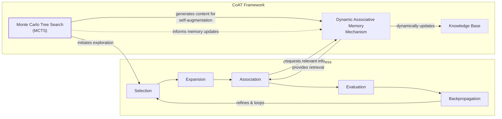
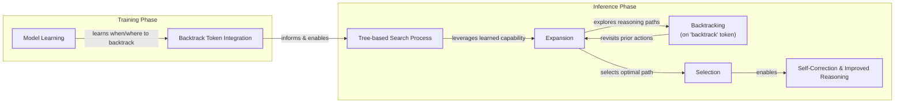
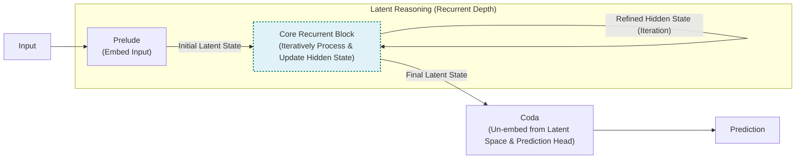
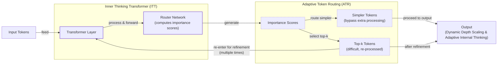
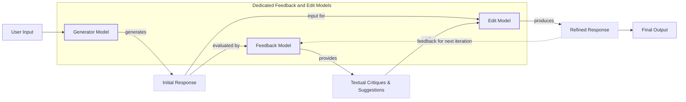

# The 2025 AI Engineer’s Guide to LLM Reasoning

In 2025, building agentic systems that can reliably solve complex, multi-step problems is a top priority for AI engineers. The direct-answer models that once seemed impressive now routinely fail at tasks requiring deep reasoning. This has sparked a surge in research aimed at making LLMs "think" more effectively before responding.

Since the release of models like DeepSeek-R1, the field has seen an explosion of techniques that blend inference-time scaling, pure reinforcement learning (RL), RL-SFT hybrids, and supervised fine-tuning (SFT) with distillation. This article focuses on one critical branch of this research: inference-time compute scaling. These methods enhance an LLM's reasoning abilities at the moment of inference, without altering its underlying weights.

Image 1: The four main categories of implementing reasoning models. This article focuses on inference-time-scaling methods. (Source [Understanding Reasoning LLMs](https://magazine.sebastianraschka.com/p/understanding-reasoning-llms) [[16]](https://magazine.sebastianraschka.com/p/understanding-reasoning-llms))

We will survey 14 recent papers that showcase diverse methods for regulating and scaling this test-time computation. We will cover everything from simple token-based controls to dynamic, latent-space strategies. To understand how these techniques fit into the broader landscape, we will first examine the four main categories of reasoning model development.

## Implementing and improving reasoning in LLMs: The four main categories

Reasoning models are LLMs designed to generate an explicit or internal thought process before producing a final answer [[16]](https://magazine.sebastianraschka.com/p/understanding-reasoning-llms). This contrasts with direct-answer models, which map an input directly to an output in a single forward pass. The intermediate steps, whether visible to the user or not, allow the model to break down complex problems, verify its logic, and correct mistakes along the way.

Image 2: A regular LLM may only provide a short answer, whereas reasoning models typically include intermediate steps that reveal the thought process. (Source [Understanding Reasoning LLMs](https://magazine.sebastianraschka.com/p/understanding-reasoning-llms) [[16]](https://magazine.sebastianraschka.com/p/understanding-reasoning-llms))

There are two primary ways to enhance an LLM's reasoning capabilities: increasing training compute or increasing inference compute. Training compute involves modifying the model's weights through methods like RL or SFT. This is like studying for an exam; you are permanently encoding knowledge into the model.

Inference compute, on the other hand, involves allocating extra FLOPs at test time without changing the model's weights. The simplest example is chain-of-thought (CoT) prompting, where you ask the model to "think step by step." This encourages it to generate a longer, more detailed response, effectively using more computation to arrive at the answer. This is like taking extra time to solve a problem during the exam itself.

Image 3: Accuracy improvements can be achieved through increased training or test-time compute. Test-time compute is synonymous with inference-time compute and scaling. (Source [S*: Test Time Scaling for Code Generation](https://arxiv.org/abs/2502.14382) [[65]](https://arxiv.org/abs/2502.14382))

In practice, most state-of-the-art systems combine both. Heavy train-time preparation equips the model with strong foundational reasoning skills, while test-time thinking allows it to apply those skills to specific, complex problems. Relying on training alone can lead to issues like reward hacking, where the model learns to exploit the reward function without genuinely improving its reasoning. Conversely, pure inference scaling on a weak base model often yields limited gains.

The development of reasoning models generally falls into four main categories, as outlined by Sebastian Raschka [[16]](https://magazine.sebastianraschka.com/p/understanding-reasoning-llms).

Image 4: The four main categories for developing reasoning models. (Source [Understanding Reasoning LLMs](https://magazine.sebastianraschka.com/p/understanding-reasoning-llms) [[16]](https://magazine.sebastianraschka.com/p/understanding-reasoning-llms))

**Inference-time compute scaling** improves reasoning capabilities without modifying the underlying model. This approach increases computational resources during inference to enhance output quality. While models like OpenAI's o1 are suspected to use this technique, the DeepSeek R1 technical report noted that their explicit attempts at inference-time methods were largely unsuccessful. However, their model does exhibit an implicit form of inference scaling by generating longer, more detailed responses, which naturally increases inference costs [[16]](https://magazine.sebastianraschka.com/p/understanding-reasoning-llms).

**Pure reinforcement learning** has shown that reasoning can emerge as a learned behavior without SFT. The DeepSeek-R1-Zero model, for example, was trained exclusively with RL on top of a pre-trained base model. This "cold start" approach, which skipped the SFT stage, was sufficient for the model to develop basic reasoning skills, including generating intermediate "thinking" steps [[16]](https://magazine.sebastianraschka.com/p/understanding-reasoning-llms). However, this method can be challenging to implement and may not be as effective for smaller models.

**Reinforcement learning and supervised fine-tuning** is the approach used to build high-performance reasoning models like DeepSeek-R1. This method combines an SFT stage, which provides the model with high-quality reasoning examples, with an RL stage that further refines its problem-solving abilities. The SFT data often includes CoT examples, and the RL stage may use a combination of verifiable rewards (for math and coding) and human preference-based rewards [[16]](https://magazine.sebastianraschka.com/p/understanding-reasoning-llms).

**Supervised fine-tuning and model distillation** is an effective strategy for creating smaller, more efficient reasoning models. In this context, distillation refers to instruction fine-tuning a smaller LLM on an SFT dataset generated by a larger, more powerful model. While this approach does not drive innovation in the same way as developing a new state-of-the-art model, it is a cost-effective way to transfer reasoning capabilities to smaller models [[16]](https://magazine.sebastianraschka.com/p/understanding-reasoning-llms).

With these four categories mapped out, we can now zoom in on the inference-time compute scaling branch, which forms the core of this article.

## Inference-time compute scaling methods

The central idea behind inference-time compute scaling is that allowing an LLM to "think longer" can lead to better answers, much like how humans benefit from spending more time on difficult problems. This is achieved by allocating additional computational resources at the moment of inference to improve the quality of the output [[16]](https://magazine.sebastianraschka.com/p/understanding-reasoning-llms).

This idea has historical parallels in game AI like AlphaGo, which used extensive search at inference time to evaluate possible moves—a step critical to its superhuman performance [[72]](https://ve3.global/blog/inference-time-scaling-the-next-frontier-in-ai-performance). The concept also echoes ensemble methods in classic machine learning, which trade more compute for better results by combining multiple models [[73]](https://magazine.sebastianraschka.com/p/categories-of-inference-time-scaling).

The most classic approach is through prompt engineering. CoT prompting, which encourages the model to generate intermediate reasoning steps, is a form of inference-time scaling because it increases the number of output tokens, leading to higher latency and cost [[32]](https://tianpan.co/blog/2026-04-10-token-economics-chain-of-thought-when-thinking-costs-more), [[33]](https://aclanthology.org/2025.emnlp-main.165.pdf), [[34]](https://www.aussieai.com/research/cot-optimization), [[35]](https://arxiv.org/html/2406.09136v1), [[36]](https://gail.wharton.upenn.edu/research-and-insights/tech-report-chain-of-thought). While this can improve accuracy on complex problems, it is often inefficient for simpler tasks.

Image 5: An example of classic CoT prompting. (Source [Large Language Models are Zero-Shot Reasoners](https://arxiv.org/abs/2205.11916) [[71]](https://arxiv.org/abs/2205.11916))

More advanced techniques involve search and voting strategies. Majority voting, for instance, generates multiple answers and selects the one that appears most frequently. Beam search and other algorithms explore different reasoning paths and use a Process Reward Model (PRM) to select the most promising one. PRMs evaluate each step of the reasoning process, providing more granular feedback than models that only score the final outcome [[37]](https://openreview.net/forum?id=l19DmXbwPK), [[38]](https://icml.cc/virtual/2025/oral/47195), [[39]](https://arxiv.org/html/2512.15146v1), [[40]](https://cdn.openai.com/improving-mathematical-reasoning-with-process-supervision/Lets_Verify_Step_by_Step.pdf), [[41]](https://cameronrwolfe.substack.com/p/reward-models).

Image 6: Different search-based methods use a process-reward-based model to select the best answer. (Source [Scaling LLM Test-Time Compute Optimally can be More Effective than Scaling Model Parameters](https://arxiv.org/abs/2408.03314) [[69]](https://arxiv.org/abs/2408.03314))

These methods represent a shift from static prompting to dynamic, compute-intensive strategies that actively guide the model's reasoning process. The *s1* paper, which we will examine next, provides a concrete example of these ideas, combining curated reasoning traces with explicit length-control tokens to regulate test-time compute.

## s1: Simple test-time scaling

The paper "[s1: Simple test-time scaling](https://arxiv.org/abs/2501.19393)" (January 31, 2025) introduces a hybrid approach that combines a small, carefully curated 1k-example SFT dataset with an inference-time length control mechanism [[1]](https://medium.com/@jdegange85/paper-review-of-s1-simple-test-time-scaling-6094eff9c1e8), [[2]](https://huggingface.co/papers/2501.19393). This distinguishes it from pure distillation methods, as it actively manages the model's "thinking" process at runtime.

Image 7: Illustration of "wait" token insertion to control the length of the output. (Source [S*: Test Time Scaling for Code Generation](https://arxiv.org/abs/2502.14382) [[65]](https://arxiv.org/abs/2502.14382))

The core mechanism is "budget forcing," a sequential scaling technique that controls the length of the model's reasoning trace. If the model tries to stop thinking too early, the system suppresses the end-of-thinking signal and appends a "Wait" token. This simple intervention encourages the model to continue its analysis, often leading to self-correction and improved accuracy [[1]](https://medium.com/@jdegange85/paper-review-of-s1-simple-test-time-scaling-6094eff9c1e8). This is in contrast to parallel methods like majority voting, which generate multiple independent responses. Budget forcing directly manipulates the length and depth of a single reasoning path.

The paper reports a clear correlation between the length of the generated response and the accuracy of the final answer on reasoning benchmarks. As the model is forced to "think" longer, its performance tends to improve, up to a certain point. This aligns with the "Aha moment" observed in the DeepSeek-R1 training, where the model spontaneously began to use words like "wait" during self-reflection [[68]](https://arxiv.org/abs/2501.12948).

Image 8: Correlation between response accuracy and length. (Source [s1: Simple test-time scaling](https://arxiv.org/abs/2501.19393) [[67]](https://arxiv.org/abs/2501.19393))

Interestingly, the choice of token matters. An empirical comparison showed that appending "Wait" led to better accuracy than a more neutral phrase like "Hmm," suggesting that the "Wait" token specifically triggers a process of doubt and re-evaluation rather than just extending the generation time [[2]](https://huggingface.co/papers/2501.19393).

Image 9: "Wait" vs "Hmm" tokens. (Source [S*: Test Time Scaling for Code Generation](https://arxiv.org/abs/2502.14382) [[65]](https://arxiv.org/abs/2502.14382))

However, the paper also acknowledges its limitations. The authors call for future work to compare budget forcing against other sequential methods like beam search, lookahead search, and compute-optimal search, as well as to establish a stronger baseline against standard CoT prompting [[67]](https://arxiv.org/abs/2501.19393).

## Other noteworthy research papers on inference-time compute scaling

The high volume of recent papers on this topic makes it impractical to cover each one in exhaustive detail. Instead, we will provide brief summaries of several noteworthy contributions, allowing you to see the breadth of the research landscape without getting bogged down in repetitive explanations.

A common pattern you will notice is that many of these papers blend some form of training with explicit control of inference-time compute. This is different from pure distillation or SFT approaches that simply train a model to produce longer outputs. The methods we will discuss involve active regulation of the model's compute budget or reasoning process during inference.

## Test-Time Preference Optimization

"[Test-Time Preference Optimization: On-the-Fly Alignment via Iterative Textual Feedback](https://arxiv.org/abs/2501.12895)" introduces an iterative alignment process that occurs entirely at inference time, avoiding any changes to the underlying model weights [[3]](https://icml.cc/virtual/2025/poster/46149), [[4]](https://proceedings.mlr.press/v267/li25ac.html). This positions it as a pure inference-time method.

The framework operates in a four-step loop. First, it generates multiple responses to a given query. Then, a reward model scores these responses, selecting the best ("chosen") and worst ("rejected") ones. The system then generates textual critiques and suggestions based on this comparison, which are used to guide the model in refining its output in the next iteration. This process repeats, progressively improving the quality of the generated responses on a per-query basis [[3]](https://icml.cc/virtual/2025/poster/46149).

Image 10: The Test-Time Preference Optimization process. (Source [Test-Time Preference Optimization: On-the-Fly Alignment via Iterative Textual Feedback](https://arxiv.org/abs/2501.12895) [[70]](https://arxiv.org/abs/2501.12895))

## Thoughts Are All Over the Place

The paper "[Thoughts Are All Over the Place: On the Underthinking of o1-Like LLMs](https://arxiv.org/abs/2501.18585)" identifies a phenomenon called "underthinking" in o1-like models, where frequent switching between reasoning paths can actually reduce the accuracy of the final answer [[5]](https://www.linkedin.com/pulse/thoughts-all-over-place-underthinking-o1-like-llms-vlad-bogolin-rhnme), [[6]](https://tldr.takara.ai/p/2501.18585).

To address this, the authors propose the Thought Switching Penalty (TIP) method. This technique modifies the model's logits at inference time to discourage premature transitions between different lines of thought, all without any fine-tuning. By penalizing tokens associated with thought switching, TIP encourages the model to explore each promising reasoning path more deeply. The paper reports that this no-fine-tuning approach improves accuracy on challenging benchmarks by forcing the model to engage in more thorough and focused reasoning [[5]](https://www.linkedin.com/pulse/thoughts-all-over-place-underthinking-o1-like-llms-vlad-bogolin-rhnme).

Image 11: Visualization of the Thought Switching Penalty method. (Source [S*: Test Time Scaling for Code Generation](https://arxiv.org/abs/2502.14382) [[65]](https://arxiv.org/abs/2502.14382))

## Trading Inference-Time Compute for Adversarial Robustness

The paper "[Trading Inference-Time Compute for Adversarial Robustness](https://arxiv.org/abs/2501.18841)" explores the relationship between inference-time compute and model safety. It finds that increasing the amount of computation at inference time generally reduces the success rate of adversarial attacks, even without any specific adversarial training [[7]](https://cdn.openai.com/papers/trading-inference-time-compute-for-adversarial-robustness-20250121_1.pdf), [[8]](https://openai.com/index/trading-inference-time-compute-for-adversarial-robustness), [[9]](https://huggingface.co/papers/2501.18841). The paper's empirical trade-off curves show a clear trend: as the model "thinks" longer, it becomes more resilient to attacks.

However, the authors highlight important exceptions where these gains are limited. In scenarios involving policy ambiguity or the exploitation of loopholes, increased thinking time does not always lead to better robustness [[8]](https://openai.com/index/trading-inference-time-compute-for-adversarial-robustness). The paper also introduces new attack strategies, such as "Think Less" and "Nerd Sniping," which are designed to counteract the robustness gains from scaling.

The conclusion is that while inference scaling is a valuable tool for improving LLM safety, it is not a complete solution on its own [[7]](https://cdn.openai.com/papers/trading-inference-time-compute-for-adversarial-robustness-20250121_1.pdf). This conclusion, however, assumes the model's reasoning steps are hidden. If they are exposed, research shows an "inverse scaling law" can emerge: more compute *decreases* robustness by expanding the attack surface, a risk particularly relevant for tool-use and prompt extraction attacks [[74]](https://arxiv.org/html/2507.15974v1).

Image 12: Analysis of trading inference-time compute for adversarial robustness. (Source [TRADING INFERENCE-TIME COMPUTE FOR ADVERSARIAL ROBUSTNESS.](https://arxiv.org/abs/2501.18841) [[61]](https://arxiv.org/abs/2501.18841))

## Chain-of-Associated-Thoughts

The paper "[CoAT: Chain-of-Associated-Thoughts Framework for Enhancing Large Language Models Reasoning](https://arxiv.org/abs/2502.02390)" proposes a framework that combines Monte Carlo Tree Search (MCTS) with an "associative memory" that functions as a dynamic knowledge base during inference [[21]](https://arxiv.org/html/2502.02390v3).

This associative memory allows the model to recall earlier reasoning paths and incorporate newly generated information without losing context. The MCTS component, in turn, provides a structured way to explore different reasoning pathways. The synergy between these two elements enables a more systematic and context-aware exploration of the solution space at test time, leading to more accurate and comprehensive outputs [[21]](https://arxiv.org/html/2502.02390v3).



Image 13: Mermaid diagram illustrating the CoAT (Chain-of-Associated-Thoughts) framework, combining MCTS with dynamic associative memory and its interaction with a knowledge base.

## Step Back to Leap Forward

"[Step Back to Leap Forward: Self-Backtracking for Boosting Reasoning of Language Models](https://arxiv.org/abs/2502.04404)" introduces a self-backtracking mechanism that teaches models to recognize and correct their own suboptimal reasoning paths [[22]](https://arxiv.org/html/2502.04404v1), [[23]](https://ojs.aaai.org/index.php/AAAI/article/view/39986/43947).

The key innovation is the use of a special "backtrack" token. During the training phase, the model learns to generate this token when it identifies a point in its reasoning where it has gone astray. At inference time, the model leverages this learned ability to perform a tree-based search. When the backtrack token is generated, the model revisits its previous steps and explores alternative paths.

A significant advantage of this approach is that it does not require an external reward model, unlike standard process-reward-guided search methods. The model learns to evaluate its own reasoning paths and decide when to backtrack, making it a more self-contained and efficient system. This allows the model to dynamically adjust its search depth and breadth, leading to more robust and flexible reasoning [[22]](https://arxiv.org/html/2502.04404v1).



Image 14: Mermaid diagram illustrating the Self-Backtracking mechanism from the "Step Back to Leap Forward" paper, showing Training and Inference phases.

## Scaling up Test-Time Compute with Latent Reasoning

The paper "[Scaling Test-Time Compute: How Recurrent Depth Transforms AI Reasoning](https://medium.com/@sahin.samia/scaling-test-time-compute-how-recurrent-depth-transforms-ai-reasoning-fa866fa968db)" explores a different approach to scaling test-time compute: iterating in latent space rather than generating more output tokens [[24]](https://huggingface.co/papers/2502.05171), [[25]](https://openreview.net/forum?id=S3GhJooWIC), [[26]](https://neurips.cc/virtual/2025/poster/117966), [[27]](https://icml.cc/virtual/2025/51856), [[28]](https://medium.com/@sahin.samia/scaling-test-time-compute-how-recurrent-depth-transforms-ai-reasoning-fa866fa968db).

This technique, known as recurrent depth, allows the model to perform multiple rounds of internal computation on the same input, refining its understanding before producing an output. This is similar to the behavior of Recurrent Neural Networks (RNNs), where the hidden state is updated iteratively. The process converges when the hidden state reaches a stable fixed point. This is often controlled at inference time by a KL-divergence threshold, which halts the iterations once the latent representation has stabilized [[75]](https://www.lesswrong.com/posts/pLnLSgWphqDbdorgi/on-recent-results-in-llm-latent-reasoning), [[76]](https://arxiv.org/html/2605.26733v1).

The main advantage is that the model can "think" for as long as needed without increasing the length of the visible output. However, this comes with a major drawback: the absence of explicit reasoning steps makes it difficult for humans to interpret or debug the model's thought process [[24]](https://huggingface.co/papers/2502.05171).



Image 15: Mermaid diagram illustrating the recurrent depth approach for scaling test-time compute with latent reasoning.

## Can a 1B LLM Surpass a 405B LLM?

The paper "[Can 1B LLM Surpass 405B LLM? Rethinking Compute-Optimal Test-Time Scaling](https://arxiv.org/abs/2502.06703)" conducts a systematic study of the interactions between inference-time scaling, PRMs, and problem difficulty. The authors propose a "compute-optimal" scaling strategy that adapts the inference budget based on the choice of PRM, the size of the policy model, and the complexity of the task at hand.

The most striking finding is that a 1B model, when paired with the right scaling strategy, can outperform an unscaled 405B Llama 3 model on the same benchmarks. This provides strong evidence that a well-allocated inference budget can allow smaller, more efficient models to surpass much larger ones. This has direct implications for AI engineers, as it highlights the importance of making informed trade-off decisions between model size, cost, and performance.

Image 16: Compute-optimal scaling comparison. (Source [Can 1B LLM Surpass 405B LLM? Rethinking Compute-Optimal Test-Time Scaling](https://arxiv.org/abs/2502.06703) [[63]](https://arxiv.org/abs/2502.06703))

## Learning to Reason from Feedback at Test-Time

The method presented in "[Inference-Time Computations for LLM Reasoning and Planning: A Benchmark and Insights](https://www.arxiv.org/abs/2502.12521)" is challenging to classify as either a pure inference-time or training-time technique because it updates the model's weights during inference.

The paper introduces the OpTune optimizer, which adjusts the model's weights based on previous mistakes without storing the failed attempts in the prompt context. This is in contrast to sequential revision methods, which grow the context with each attempt, and parallel sampling approaches, which generate multiple independent responses.

The main benefit of this approach is that the model can "remember" its errors through lightweight weight updates, rather than relying on an ever-expanding context window. This makes it a more scalable solution for long, iterative reasoning tasks. However, the need to perform weight updates at inference time adds a layer of complexity that is not present in pure inference-time methods.

Image 17: Visualization of the OpTune optimizer. (Source [Inference-Time Computations for LLM Reasoning and Planning: A Benchmark and Insights](https://www.arxiv.org/abs/2502.12521) [[64]](https://www.arxiv.org/abs/2502.12521))

## Inference-Time Computations for LLM Reasoning and Planning

The paper "[Inference-Time Computations for LLM Reasoning and Planning: A Benchmark and Insights](https://www.arxiv.org/abs/2502.12521)" introduces Sys2Bench, a comprehensive benchmark for evaluating inference-time techniques across eleven diverse tasks [[29]](https://github.com/usail-hkust/benchmark_inference_time_computation_LLM), [[30]](https://github.com/usail-hkust/benchmark_inference_time_computation_LLM), [[31]](https://github.com/usail-hkust/benchmark_inference_time_computation_LLM). The benchmark covers arithmetic, logical, commonsense, and algorithmic reasoning, as well as planning domains.

The authors evaluate a range of techniques, including CoT, Tree-of-Thought, and Reasoning as Planning. The key insight from their extensive experiments is that no single inference-time technique dominates across all task types. This forces engineers to match the right method to the specific domain they are working in. The paper also provides a valuable analysis of the trade-offs between computational cost and performance, helping practitioners make more informed decisions when choosing an inference-time strategy [[64]](https://www.arxiv.org/abs/2502.12521).

Image 18: Benchmark results for inference-time computations. (Source [Inference-Time Computations for LLM Reasoning and Planning: A Benchmark and Insights](https://www.arxiv.org/abs/2502.12521) [[64]](https://www.arxiv.org/abs/2502.12521))

## Inner Thinking Transformer

The "[Inner Thinking Transformer: Leveraging Dynamic Depth Scaling to Foster Adaptive Internal Thinking](https://arxiv.org/abs/2502.13842)" introduces the concept of dynamic depth scaling, which avoids using a fixed number of transformer layers for every token [[12]](https://aclanthology.org/2025.acl-long.1369.pdf), [[13]](https://arxiv.org/pdf/2502.13842), [[14]](https://arxiv.org/html/2502.13842v1), [[15]](https://www.emergentmind.com/topics/inner-thinking-transformer-itt).

The core mechanism is Adaptive Token Routing (ATR), which identifies "difficult" tokens and sends them through the same layer multiple times. This selectively increases the inference compute budget for the tokens that need it most. The main advantage is that the model can allocate extra "thinking" effort exactly where it is required, without lengthening the overall output sequence. This allows for a more efficient and targeted use of computational resources [[12]](https://aclanthology.org/2025.acl-long.1369.pdf).

This efficiency translates to measurable performance gains. For example, a 162M parameter ITT model with four thinking steps outperformed a standard Transformer of the same size, achieving a 1.7% accuracy improvement where a comparable "Loop" variant only gained 0.3% [[77]](https://liner.com/review/inner-thinking-transformer-leveraging-dynamic-depth-scaling-to-foster-adaptive).



Image 19: Mermaid diagram illustrating the Inner Thinking Transformer (ITT) with Adaptive Token Routing (ATR).

## Test Time Scaling for Code Generation

The paper "[S\*: Test Time Scaling for Code Generation](https://arxiv.org/abs/2502.14382)" proposes the S\* method, a technique specialized for code generation that combines parallel generation of candidate solutions with sequential iterative debugging [[65]](https://arxiv.org/abs/2502.14382).

```mermaid
flowchart LR
  %% S* (S-star) Framework for Test Time Scaling in Code Generation
  subgraph "S* Framework"
    direction LR

    subgraph "Stage 1: Generation"
      PS["Parallel Sampling"]
      SS["Sequential Scaling<br/>(Iterative Debugging)"]
      EFP["Execution Feedback<br/>(Public Test Cases)"]

      PS -- "augments" --> SS
      SS -- "grounded with" --> EFP
    end

    subgraph "Stage 2: Selection"
      AIS["Adaptive Input Synthesis"]
      LLM["LLM<br/>(Generates Distinguishing Test Inputs)"]
      PC["Pairwise Comparison"]
      EGI["Execution-Grounded Information"]
      ICS["Identify Correct Solutions"]

      AIS -- "uses" --> LLM
      LLM -- "generates inputs for" --> PC
      PC -- "combined with" --> EGI
      PC & EGI -- "to" --> ICS
    end

    "Stage 1: Generation" -- "candidate solutions" --> "Stage 2: Selection"
  end

  %% Visual grouping
  classDef stage stroke-width:2px
  class "Stage 1: Generation","Stage 2: Selection" stage
```

Image 20: Mermaid diagram illustrating the S* (S-star) framework for Test Time Scaling in Code Generation, showing its two stages: Generation and Selection.

The framework operates in a two-stage process. The first stage, generation, involves using execution feedback from public test cases to guide the model. The second stage focuses on the adaptive selection and repair of the generated candidates.

A key technique in this stage is "adaptive input synthesis," where the model creates discriminating test cases specifically designed to distinguish between solutions that pass the initial public tests. By leveraging execution results and error messages, S\* can iteratively repair and refine its solutions, leading to more robust and accurate code generation. This approach connects back to earlier Google research on optimal test-time compute scaling, applying similar principles to the domain of code [[65]](https://arxiv.org/abs/2502.14382).

## Chain of Draft

The paper "[Chain of Draft: Thinking Faster by Writing Less](https://arxiv.org/abs/2502.18600)" makes a simple but powerful observation: humans often use concise drafts or shorthand notes rather than verbose, step-by-step explanations when solving problems internally [[42]](https://www.helicone.ai/blog/chain-of-draft), [[43]](https://www.analyticsvidhya.com/blog/2025/03/chain-of-draft), [[44]](https://medium.com/data-science-in-your-pocket/what-is-chain-of-drafts-bye-bye-chain-of-thoughts-76658d913169), [[45]](https://aws.amazon.com/blogs/machine-learning/move-beyond-chain-of-thought-with-chain-of-draft-on-amazon-bedrock), [[46]](https://arxiv.org/html/2502.18600v1).

Based on this insight, the authors propose Chain of Draft (CoD) prompting. This technique encourages the model to generate minimal yet informative intermediate steps, such as equations or key terms, instead of full natural-language reasoning. The results are impressive: CoD drastically reduces the token count, leading to significant efficiency gains in terms of both cost and latency, while maintaining an accuracy comparable to that of full CoT on various reasoning benchmarks.

Image 21: Comparison of Chain of Draft with other methods. (Source [Chain of Draft: Thinking Faster by Writing Less](https://arxiv.org/abs/2502.18600) [[46]](https://arxiv.org/html/2502.18600v1))

This approach does come with a trade-off. The loss of human-readable reasoning traces can make it more difficult to debug or interpret the model's thought process. However, for applications where efficiency is paramount and full interpretability is not a strict requirement, CoD offers a compelling alternative to traditional CoT prompting [[46]](https://arxiv.org/html/2502.18600v1).

## Better Feedback and Edit Models

Applying inference scaling to open-ended tasks like creative writing or high-level planning is challenging because there are no easily verifiable answers. The paper "[Dedicated Feedback and Edit Models Empower Inference-Time Scaling for Open-Ended General-Domain Tasks](https://arxiv.org/abs/2503.04378)" addresses this by proposing a specialized architecture that decouples the generation, feedback, and editing processes [[47]](https://arxiv.org/html/2503.04378v1), [[48]](https://liner.com/ko/review/dedicated-feedback-and-edit-models-empower-inferencetime-scaling-for-openended).

The system consists of three distinct models: a generator, a feedback model, and an edit model. Each is optimized for its specific role. The feedback and edit models are trained on large, human-annotated datasets of responses, critiques, and revisions. This allows them to produce higher-quality signals than a single, all-purpose model could generate through a generic self-critique loop. During inference, these dedicated models enable an iterative refinement process that has been shown to surpass the performance of standard self-correction methods on open-ended tasks [[47]](https://arxiv.org/html/2503.04378v1).



Image 22: System architecture for Dedicated Feedback and Edit Models illustrating an iterative refinement loop.

## Conclusion

Inference-time compute scaling has firmly established itself as a major research direction in 2025, primarily because it offers a way to enhance the reasoning capabilities of existing models without the need for permanent weight modifications. As we have seen, the techniques for achieving this are incredibly diverse, ranging from simple "Wait" tokens and budget forcing to sophisticated search algorithms, dynamic routing, and even latent-space iteration.

A recurring theme across these papers is the remarkable finding that smaller models, when equipped with proper inference-time scaling, can often rival or even exceed the performance of much larger models that lack such scaling. This has profound implications for AI engineers, as it directly impacts the trade-offs between model size, training costs, latency, and accuracy. For example, the ability to achieve state-of-the-art performance with a smaller, more efficient model can be a game-changer for production systems where cost and speed are critical.

However, it is important to acknowledge the caveats. Increased inference-time compute almost always comes at the cost of higher latency, which can negatively impact the user experience. Furthermore, as the Sys2Bench paper demonstrated, there is no universally best technique that works across all tasks. More critically, the safety benefits of increased compute may rely on the assumption that the model's internal reasoning is hidden. Recent research shows that if these reasoning steps are exposed, an "inverse scaling law" can emerge where more thinking actually *decreases* robustness by creating a larger attack surface [[74]](https://arxiv.org/html/2507.15974v1). The optimal approach often depends on the specific domain, the complexity of the problem, and the capabilities of the base model.

To mitigate the performance costs, the hardware ecosystem is rapidly evolving. Specialized accelerators—from next-generation GPUs and optimized CPUs to experimental architectures like Processing-in-Memory (PIM)—are being designed to handle these compute-intensive inference strategies more efficiently [[78]](https://gradientflow.substack.com/p/llm-inference-hardware-emerging-from), [[79]](https://community.juniper.net/blogs/sharada-yeluri/2024/02/20/llm-inference-hw-sw-optimizations). This trend toward LLM-hardware co-design will be critical for making advanced reasoning practical at scale.

[](https://substackcdn.com/image/fetch/w_1456,c_limit,f_auto,q_auto:good,fl_progressive:steep/https%3A%2F%2Fsubstack-post-media.s3.amazonaws.com%2Fpublic%2Fimages%2Fc1f749e4-4167-4013-b1c9-651c83bf8d3b_1504x756.png)

Image 23: Feedback and Edit Models enable effective Inference-Time scaling across various dimensions. (Source [Dedicated Feedback and Edit Models Empower Inference-Time Scaling for Open-Ended General-Domain Tasks](https://arxiv.org/html/2503.04378v1) [[47]](https://arxiv.org/html/2503.04378v1))

Looking ahead, we are seeing an emerging industry trend toward "thinking-on-demand" toggles. These features allow developers or even end-users to dial the amount of inference compute up or down depending on the difficulty of the task. This dynamic allocation of resources represents a more intelligent and efficient way to leverage the power of reasoning models.

As we move forward, it is becoming clear that explicit reasoning will likely become the default mode of operation for future agentic systems, rather than an optional feature. The ability to "think" before acting is fundamental to building robust, reliable, and truly intelligent AI.

In our next article, we will shift our focus to train-time compute scaling methods, exploring advanced reinforcement learning techniques, hybrid RL-SFT approaches, and distillation strategies in depth.

## References

- [1] Paper review of s1: Simple test-time scaling. (n.d.). Medium. [[https://medium.com/@jdegange85/paper-review-of-s1-simple-test-time-scaling-6094eff9c1e8]](https://medium.com/@jdegange85/paper-review-of-s1-simple-test-time-scaling-6094eff9c1e8)
- [2] s1: Simple test-time scaling. (n.d.). Hugging Face. [[https://huggingface.co/papers/2501.19393]](https://huggingface.co/papers/2501.19393)
- [3] Test-Time Preference Optimization. (n.d.). ICML. [[https://icml.cc/virtual/2025/poster/46149]](https://icml.cc/virtual/2025/poster/46149)
- [4] Test-Time Preference Optimization. (n.d.). Proceedings of Machine Learning Research. [[https://proceedings.mlr.press/v267/li25ac.html]](https://proceedings.mlr.press/v267/li25ac.html)
- [5] Thoughts Are All Over the Place: On the Underthinking of o1-Like LLMs. (n.d.). LinkedIn. [[https://www.linkedin.com/pulse/thoughts-all-over-place-underthinking-o1-like-llms-vlad-bogolin-rhnme]](https://www.linkedin.com/pulse/thoughts-all-over-place-underthinking-o1-like-llms-vlad-bogolin-rhnme)
- [6] Thoughts Are All Over the Place: On the Underthinking of o1-Like LLMs. (n.d.). TLDR. [[https://tldr.takara.ai/p/2501.18585]](https://tldr.takara.ai/p/2501.18585)
- [7] Trading Inference-Time Compute for Adversarial Robustness. (n.d.). OpenAI. [[https://cdn.openai.com/papers/trading-inference-time-compute-for-adversarial-robustness-20250121_1.pdf]](https://cdn.openai.com/papers/trading-inference-time-compute-for-adversarial-robustness-20250121_1.pdf)
- [8] Trading inference-time compute for adversarial robustness. (n.d.). OpenAI. [[https://openai.com/index/trading-inference-time-compute-for-adversarial-robustness]](https://openai.com/index/trading-inference-time-compute-for-adversarial-robustness)
- [9] Trading Inference-Time Compute for Adversarial Robustness. (n.d.). Hugging Face. [[https://huggingface.co/papers/2501.18841]](https://huggingface.co/papers/2501.18841)
- [12] Inner Thinking Transformer. (n.d.). ACL Anthology. [[https://aclanthology.org/2025.acl-long.1369.pdf]](https://aclanthology.org/2025.acl-long.1369.pdf)
- [13] Inner Thinking Transformer. (n.d.). arXiv. [[https://arxiv.org/pdf/2502.13842]](https://arxiv.org/pdf/2502.13842)
- [14] Inner Thinking Transformer. (n.d.). arXiv. [[https://arxiv.org/html/2502.13842v1]](https://arxiv.org/html/2502.13842v1)
- [15] Inner Thinking Transformer (ITT). (n.d.). Emergent Mind. [[https://www.emergentmind.com/topics/inner-thinking-transformer-itt]](https://www.emergentmind.com/topics/inner-thinking-transformer-itt)
- [16] Understanding Reasoning LLMs. (n.d.). Sebastian Raschka's Magazine. [[https://magazine.sebastianraschka.com/p/understanding-reasoning-llms]](https://magazine.sebastianraschka.com/p/understanding-reasoning-llms)
- [21] CoAT: Chain-of-Associated-Thoughts Framework for Enhancing Large Language Models Reasoning. (n.d.). arXiv. [[https://arxiv.org/html/2502.02390v3]](https://arxiv.org/html/2502.02390v3)
- [22] Step Back to Leap Forward: Self-Backtracking for Boosting Reasoning of Language Models. (n.d.). arXiv. [[https://arxiv.org/html/2502.04404v1]](https://arxiv.org/html/2502.04404v1)
- [23] Step Back to Leap Forward: Self-Backtracking for Boosting Reasoning of Language Models. (n.d.). AAAI. [[https://ojs.aaai.org/index.php/AAAI/article/view/39986/43947]](https://ojs.aaai.org/index.php/AAAI/article/view/39986/43947)
- [24] Scaling test-time computation by implicitly reasoning in latent space. (n.d.). Hugging Face. [[https://huggingface.co/papers/2502.05171]](https://huggingface.co/papers/2502.05171)
- [25] Scaling test-time computation by implicitly reasoning in latent space. (n.d.). OpenReview. [[https://openreview.net/forum?id=S3GhJooWIC]](https://openreview.net/forum?id=S3GhJooWIC)
- [26] Scaling test-time computation by implicitly reasoning in latent space. (n.d.). NeurIPS. [[https://neurips.cc/virtual/2025/poster/117966]](https://neurips.cc/virtual/2025/poster/117966)
- [27] Scaling test-time computation by implicitly reasoning in latent space. (n.d.). ICML. [[https://icml.cc/virtual/2025/51856]](https://icml.cc/virtual/2025/51856)
- [28] Scaling Test-Time Compute: How Recurrent Depth Transforms AI Reasoning. (n.d.). Medium. [[https://medium.com/@sahin.samia/scaling-test-time-compute-how-recurrent-depth-transforms-ai-reasoning-fa866fa968db]](https://medium.com/@sahin.samia/scaling-test-time-compute-how-recurrent-depth-transforms-ai-reasoning-fa866fa968db)
- [29] Sys2Bench benchmark repository. (n.d.). GitHub. [[https://github.com/usail-hkust/benchmark_inference_time_computation_LLM]](https://github.com/usail-hkust/benchmark_inference_time_computation_LLM)
- [30] Sys2Bench benchmark repository. (n.d.). GitHub. [[https://github.com/usail-hkust/benchmark_inference_time_computation_LLM]](https://github.com/usail-hkust/benchmark_inference_time_computation_LLM)
- [31] Sys2Bench benchmark repository. (n.d.). GitHub. [[https://github.com/usail-hkust/benchmark_inference_time_computation_LLM]](https://github.com/usail-hkust/benchmark_inference_time_computation_LLM)
- [32] Token Economics & Chain of Thought: When "Thinking" Costs More Than It's Worth. (n.d.). Tian Pan. [[https://tianpan.co/blog/2026-04-10-token-economics-chain-of-thought-when-thinking-costs-more]](https://tianpan.co/blog/2026-04-10-token-economics-chain-of-thought-when-thinking-costs-more)
- [33] Impact of Chain-of-Thought on token count and latency. (n.d.). ACL Anthology. [[https://aclanthology.org/2025.emnlp-main.165.pdf]](https://aclanthology.org/2025.emnlp-main.165.pdf)
- [34] CoT Optimization. (n.d.). Aussie AI. [[https://www.aussieai.com/research/cot-optimization]](https://www.aussieai.com/research/cot-optimization)
- [35] Impact of Chain-of-Thought on token count and latency. (n.d.). arXiv. [[https://arxiv.org/html/2406.09136v1]](https://arxiv.org/html/2406.09136v1)
- [36] Tech Report: Chain of Thought. (n.d.). Wharton GAIL. [[https://gail.wharton.upenn.edu/research-and-insights/tech-report-chain-of-thought]](https://gail.wharton.upenn.edu/research-and-insights/tech-report-chain-of-thought)
- [37] Weighted Majority Voting with Process Reward Models. (n.d.). OpenReview. [[https://openreview.net/forum?id=l19DmXbwPK]](https://openreview.net/forum?id=l19DmXbwPK)
- [38] VersaPRM for multi-domain reasoning. (n.d.). ICML. [[https://icml.cc/virtual/2025/oral/47195]](https://icml.cc/virtual/2025/oral/47195)
- [39] SCOPE framework for test-time reinforcement learning. (n.d.). arXiv. [[https://arxiv.org/html/2512.15146v1]](https://arxiv.org/html/2512.15146v1)
- [40] Improving Mathematical Reasoning with Process Supervision. (n.d.). OpenAI. [[https://cdn.openai.com/improving-mathematical-reasoning-with-process-supervision/Lets_Verify_Step_by_Step.pdf]](https://cdn.openai.com/improving-mathematical-reasoning-with-process-supervision/Lets_Verify_Step_by_Step.pdf)
- [41] Reward Models. (n.d.). Cameron R. Wolfe. [[https://cameronrwolfe.substack.com/p/reward-models]](https://cameronrwolfe.substack.com/p/reward-models)
- [42] Chain of Draft. (n.d.). Helicone. [[https://www.helicone.ai/blog/chain-of-draft]](https://www.helicone.ai/blog/chain-of-draft)
- [43] Chain of Draft. (n.d.). Analytics Vidhya. [[https://www.analyticsvidhya.com/blog/2025/03/chain-of-draft]](https://www.analyticsvidhya.com/blog/2025/03/chain-of-draft)
- [44] What is Chain of Drafts?. (n.d.). Medium. [[https://medium.com/data-science-in-your-pocket/what-is-chain-of-drafts-bye-bye-chain-of-thoughts-76658d913169]](https://medium.com/data-science-in-your-pocket/what-is-chain-of-drafts-bye-bye-chain-of-thoughts-76658d913169)
- [45] Move beyond Chain-of-Thought with Chain-of-Draft on Amazon Bedrock. (n.d.). AWS. [[https://aws.amazon.com/blogs/machine-learning/move-beyond-chain-of-thought-with-chain-of-draft-on-amazon-bedrock]](https://aws.amazon.com/blogs/machine-learning/move-beyond-chain-of-thought-with-chain-of-draft-on-amazon-bedrock)
- [46] Chain of Draft: Thinking Faster by Writing Less. (n.d.). arXiv. [[https://arxiv.org/html/2502.18600v1]](https://arxiv.org/html/2502.18600v1)
- [47] Dedicated Feedback and Edit Models Empower Inference-Time Scaling for Open-Ended General-Domain Tasks. (n.d.). arXiv. [[https://arxiv.org/html/2503.04378v1]](https://arxiv.org/html/2503.04378v1)
- [48] Dedicated Feedback and Edit Models Empower Inference-Time Scaling for Open-Ended General-Domain Tasks. (n.d.). Liner. [[https://liner.com/ko/review/dedicated-feedback-and-edit-models-empower-inferencetime-scaling-for-openended]](https://liner.com/ko/review/dedicated-feedback-and-edit-models-empower-inferencetime-scaling-for-openended)
- [61] TRADING INFERENCE-TIME COMPUTE FOR ADVERSARIAL ROBUSTNESS. (n.d.). arXiv. [[https://arxiv.org/abs/2501.18841]](https://arxiv.org/abs/2501.18841)
- [63] Can 1B LLM Surpass 405B LLM? Rethinking Compute-Optimal Test-Time Scaling. (n.d.). arXiv. [[https://arxiv.org/abs/2502.06703]](https://arxiv.org/abs/2502.06703)
- [64] Inference-Time Computations for LLM Reasoning and Planning: A Benchmark and Insights. (n.d.). arXiv. [[https://www.arxiv.org/abs/2502.12521]](https://www.arxiv.org/abs/2502.12521)
- [65] S*: Test Time Scaling for Code Generation. (n.d.). arXiv. [[https://arxiv.org/abs/2502.14382]](https://arxiv.org/abs/2502.14382)
- [67] s1: Simple test-time scaling. (n.d.). arXiv. [[https://arxiv.org/abs/2501.19393]](https://arxiv.org/abs/2501.19393)
- [68] DeepSeek-R1: Incentivizing Reasoning Capability in LLMs via Reinforcement Learning. (n.d.). arXiv. [[https://arxiv.org/abs/2501.12948]](https://arxiv.org/abs/2501.12948)
- [69] Scaling LLM Test-Time Compute Optimally can be More Effective than Scaling Model Parameters. (n.d.). arXiv. [[https://arxiv.org/abs/2408.03314]](https://arxiv.org/abs/2408.03314)
- [70] Test-Time Preference Optimization: On-the-Fly Alignment via Iterative Textual Feedback. (n.d.). arXiv. [[https://arxiv.org/abs/2501.12895]](https://arxiv.org/abs/2501.12895)
- [71] Large Language Models are Zero-Shot Reasoners. (n.d.). arXiv. [[https://arxiv.org/abs/2205.11916]](https://arxiv.org/abs/2205.11916)
- [72] Inference-Time Scaling: The Next Frontier in AI Performance. (n.d.). VE3.GLOBAL. [[https://ve3.global/blog/inference-time-scaling-the-next-frontier-in-ai-performance]](https://ve3.global/blog/inference-time-scaling-the-next-frontier-in-ai-performance)
- [73] Categories of Inference-Time Scaling Methods. (n.d.). Sebastian Raschka's Magazine. [[https://magazine.sebastianraschka.com/p/categories-of-inference-time-scaling]](https://magazine.sebastianraschka.com/p/categories-of-inference-time-scaling)
- [74] Does More Inference-Time Compute Really Help Robustness?. (n.d.). arXiv. [[https://arxiv.org/html/2507.15974v1]](https://arxiv.org/html/2507.15974v1)
- [75] On Recent Results in LLM Latent Reasoning. (n.d.). LessWrong. [[https://www.lesswrong.com/posts/pLnLSgWphqDbdorgi/on-recent-results-in-llm-latent-reasoning]](https://www.lesswrong.com/posts/pLnLSgWphqDbdorgi/on-recent-results-in-llm-latent-reasoning)
- [76] Looped Language Models: Learning to Reason with Stable Fixed-Points. (n.d.). arXiv. [[https://arxiv.org/html/2605.26733v1]](https://arxiv.org/html/2605.26733v1)
- [77] Inner Thinking Transformer: Leveraging Dynamic Depth Scaling to Foster Adaptive Internal Thinking. (n.d.). Liner. [[https://liner.com/review/inner-thinking-transformer-leveraging-dynamic-depth-scaling-to-foster-adaptive]](https://liner.com/review/inner-thinking-transformer-leveraging-dynamic-depth-scaling-to-foster-adaptive)
- [78] LLM Inference Hardware is Emerging from the Shadows. (n.d.). The Gradient. [[https://gradientflow.substack.com/p/llm-inference-hardware-emerging-from]](https://gradientflow.substack.com/p/llm-inference-hardware-emerging-from)
- [79] LLM Inference - HW/SW optimizations. (n.d.). Juniper Networks Community. [[https://community.juniper.net/blogs/sharada-yeluri/2024/02/20/llm-inference-hw-sw-optimizations]](https://community.juniper.net/blogs/sharada-yeluri/2024/02/20/llm-inference-hw-sw-optimizations)