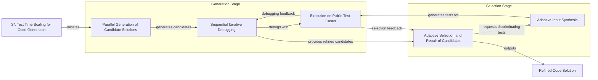

# What’s New in Test-Time Scaling?

In 2025, stronger LLM reasoning is a top priority. The complex, multi-step tasks required by modern agentic systems demand a level of reliability that simple, direct-answer models cannot provide. This has triggered a surge in research since the release of DeepSeek-R1, with new papers blending inference-time scaling, pure reinforcement learning (RL), hybrid RL and supervised fine-tuning (SFT), and SFT with distillation. The pace of innovation is accelerating.

This article provides a comprehensive survey of the most important post-DeepSeek-R1 papers on inference-time compute scaling. We will focus exclusively on this category, which enhances LLM performance by allocating additional computation during inference, without altering the model's weights.

Image 1: The four main categories of implementing reasoning models. This article focuses on inference-time-scaling methods. (Source [magazine.sebastianraschka.com](https://magazine.sebastianraschka.com/p/understanding-reasoning-llms))

To understand how these new techniques fit into the broader landscape, we will first examine each of the four main categories of reasoning model development in detail.

## Implementing and improving reasoning in LLMs: The four main categories

Reasoning models are LLMs that generate intermediate steps—either explicitly in their output or internally—before arriving at a final answer. This multi-step process mimics a "thought process" and is what separates them from standard LLMs, which perform a single forward pass to map an input directly to an output. This distinction is critical for solving complex problems that require decomposition and verification [[1]](https://magazine.sebastianraschka.com/p/understanding-reasoning-llms).

Image 2: A plain response versus a response with intermediate reasoning steps. (Source [magazine.sebastianraschka.com](https://magazine.sebastianraschka.com/p/understanding-reasoning-llms))

There are two fundamental ways to improve an LLM's reasoning capabilities: increasing training compute or increasing inference compute. Increasing training compute involves modifying the model's weights through methods like reinforcement learning (RL) or supervised fine-tuning (SFT). This is a one-time, upfront investment. In contrast, increasing inference compute involves allocating additional FLOPs at test time for each query, without changing the model's parameters. The simplest example of this is chain-of-thought (CoT) prompting, where instructing the model to "think step by step" causes it to generate more tokens, thereby using more compute to arrive at an answer [[2]](https://arxiv.org/abs/2205.11916).

In practice, the most powerful reasoning systems often combine both approaches. Heavy train-time preparation builds a strong foundation, while test-time thinking allows the model to apply that foundation to specific, difficult problems. Relying on training alone can lead to issues like reward hacking, where the model learns to exploit the reward function without genuinely improving its reasoning. On the other hand, applying pure inference-time scaling to a weak base model often yields limited gains [[1]](https://magazine.sebastianraschka.com/p/understanding-reasoning-llms).

Image 3: Performance improves with both parallel and sequential test-time compute scaling. (Source [arxiv.org](https://arxiv.org/abs/2502.14382))

The development of reasoning models generally falls into four main categories, which often overlap and build upon one another [[1]](https://magazine.sebastianraschka.com/p/understanding-reasoning-llms).

Image 4: The four main categories for developing reasoning models. (Source [magazine.sebastianraschka.com](https://magazine.sebastianraschka.com/p/understanding-reasoning-llms))

**Inference-time compute scaling** improves a model's performance by allocating more computational resources during inference, without altering its weights. This can involve techniques like CoT prompting, which increases the number of generated tokens, or more advanced search and voting strategies. Models like OpenAI's o1 are rumored to heavily leverage this approach, which would explain their higher cost and latency compared to standard models. The DeepSeek R1 paper noted that their attempts at explicit inference-time methods were largely unsuccessful. However, the model's training resulted in an implicit form of inference scaling by producing longer, more detailed responses, which naturally increases inference costs [[1]](https://magazine.sebastianraschka.com/p/understanding-reasoning-llms).

**Pure reinforcement learning (RL)** trains a model to develop reasoning abilities from scratch, using only a reward signal based on the final answer's correctness. The DeepSeek-R1-Zero model demonstrated that this approach can lead to the emergence of complex reasoning behaviors, like self-correction, without any human-annotated reasoning steps. This "cold start" training, which skips an initial SFT stage, was enough for the model to have an "Aha!" moment where it began generating reasoning traces on its own. While this proves reasoning can be an emergent behavior of pure RL, this method can be computationally expensive and may result in outputs that are difficult for humans to interpret or that mix languages [[1]](https://magazine.sebastianraschka.com/p/understanding-reasoning-llms).

**Reinforcement learning and supervised fine-tuning (RL + SFT)** is a hybrid approach that combines the strengths of both methods. It typically starts with an SFT stage to align the model with a desired output format and style, followed by an RL stage to further enhance its reasoning capabilities. This is the standard pipeline for creating many instruction-tuned models and was used to build the flagship DeepSeek-R1 model. The process involved using the R1-Zero model to generate "cold-start" SFT data, which was then used for instruction tuning. This was followed by more RL stages that included additional rewards for consistency to prevent language mixing. The final RL stage used a mix of rule-based verification for math and code, alongside human preference labels for other tasks, improving upon the R1-Zero version [[1]](https://magazine.sebastianraschka.com/p/understanding-reasoning-llms).

**Supervised fine-tuning (SFT) and model distillation** involves training a smaller "student" model on the outputs generated by a larger, more capable "teacher" model. This is not distillation in the traditional sense of matching logits, but rather a form of instruction-tuning where the student learns from the teacher's reasoning traces. The DeepSeek-R1-Distill models were created this way, training smaller Llama and Qwen models on SFT data generated by the 671B DeepSeek-R1 model. This approach makes powerful reasoning capabilities more accessible by creating smaller, more efficient models. Experiments have shown that for smaller models, distillation is often more effective than pure RL. For example, SFT on high-quality reasoning data proved to be a better strategy for smaller models than trying to induce reasoning through RL alone [[1]](https://magazine.sebastianraschka.com/p/understanding-reasoning-llms).

With these four categories mapped out, we will now zoom in on the inference-time compute scaling branch, which forms the core of this article.

## Inference-time compute scaling methods

The core idea behind inference-time compute scaling is that allowing a model to "think longer" can lead to better answers, much like how humans benefit from spending more time on difficult problems. This is achieved by allocating additional computational resources during inference to improve output quality. This idea is not entirely new; it builds on a long history of trading compute for performance, with ensemble methods in classic machine learning being a well-known precursor [[3]](https://magazine.sebastianraschka.com/p/categories-of-inference-time-scaling).

The most classic example is chain-of-thought (CoT) prompting, where a simple phrase like "Let's think step by step" encourages the model to generate intermediate reasoning steps before providing a final answer [[2]](https://arxiv.org/abs/2205.11916). While this can improve accuracy on complex problems, it also directly increases the number of generated tokens, leading to higher latency and costs [[4]](https://tianpan.co/blog/2026-04-10-token-economics-chain-of-thought-when-thinking-costs-more), [[5]](https://aclanthology.org/2025.emnlp-main.165.pdf), [[6]](https://www.aussieai.com/research/cot-optimization), [[7]](https://gail.wharton.upenn.edu/research-and-insights/tech-report-chain-of-thought).

Image 5: An example of classic CoT prompting. (Source [arxiv.org](https://arxiv.org/abs/2205.11916))

More advanced techniques involve search and voting strategies. **Majority voting**, for example, generates multiple answers and selects the one that appears most frequently. **Beam search** explores multiple potential reasoning paths simultaneously, using a process reward model (PRM) to score and prune less promising paths at each step [[8]](https://cdn.openai.com/improving-mathematical-reasoning-with-process-supervision/Lets_Verify_Step_by_Step.pdf). These methods can be either parallel (like majority voting) or sequential (like beam search), but all aim to allocate additional compute to find a better solution [[1]](https://magazine.sebastianraschka.com/p/understanding-reasoning-llms).

Image 6: Different search-based-methods rely on a process-reward-based model to select the best answer. (Source [magazine.sebastianraschka.com](https://magazine.sebastianraschka.com/p/understanding-reasoning-llms))

We will now examine a concrete recent instantiation of these ideas in the `s1` paper, which combines curated reasoning traces with explicit length-control tokens to manage inference compute.

## s1: Simple test-time scaling

The paper "[s1: Simple Test-Time Scaling](https://arxiv.org/abs/2501.19393)" (31 Jan, 2025) introduces a hybrid approach that combines a small, carefully curated SFT dataset with a simple yet effective inference-time control mechanism. Instead of relying on complex reinforcement learning or massive datasets, `s1` demonstrates that strong reasoning and test-time scaling can be achieved by fine-tuning a model on just 1,000 high-quality reasoning traces and then guiding its output length at inference [[9]](https://huggingface.co/papers/2501.19393).

The core of the `s1` method is **budget forcing**, a technique for controlling the amount of test-time compute. It works in two ways:
1.  **Forcing termination:** If the model's reasoning trace exceeds a desired token limit, an end-of-thinking token is appended to force it to produce an answer.
2.  **Lengthening the process:** If more thinking time is desired, the model is prevented from generating the end-of-thinking token. Instead, a special "Wait" token is appended to its generation. This encourages the model to pause, re-evaluate its current reasoning, and potentially self-correct errors [[10]](https://medium.com/@jdegange85/paper-review-of-s1-simple-test-time-scaling-6094eff9c1e8).

This "Wait" mechanism is more than just a way to extend the output; it actively induces doubt. The paper's experiments show that using "Wait" improves accuracy more than neutral phrases like "Hmm," suggesting it triggers a specific self-verification process [[11]](https://huggingface.co/papers/2501.19393). This is reminiscent of the "Aha moment" observed during the training of DeepSeek-R1, where the model spontaneously began to use reflective language to correct its own reasoning paths.

Image 7: Illustration of "wait" token insertion to control the length of the output. (Source [arxiv.org](https://arxiv.org/abs/2502.14382))

The paper empirically demonstrates a clear correlation between the length of the generated response and accuracy on reasoning benchmarks, showing that longer thinking time often leads to better performance. Budget forcing provides a direct way to control this, offering a sequential scaling method that contrasts with parallel approaches like majority voting.

Image 8: Correlation between response accuracy and length. (Source [arxiv.org](https://arxiv.org/abs/2502.14382))

However, the authors acknowledge limitations. The scaling effect of budget forcing eventually flattens out, and excessive use of "Wait" tokens can lead to repetitive loops rather than productive reasoning. Beyond the paper's own findings, practitioners have identified more specific failure modes. Budget forcing is reportedly less effective for certain model families like Llama and Mistral and can degrade performance on tasks where zero-shot accuracy is already high. It is also less suited for abstract domains, such as creative writing, where reasoning paths are not as clearly defined [[12]](https://iclr-blogposts.github.io/2026/blog/2026/wait-do-we-need-to-wait), [[13]](https://aclanthology.org/2025.emnlp-main.1025.pdf).

More fundamentally, research has identified cases of **inverse scaling**, where providing more thinking time actively harms performance. This can happen when models get distracted by irrelevant details in the prompt or incorrectly apply a memorized solution to a similar-looking problem. In these scenarios, more computation simply reinforces a flawed reasoning pattern instead of correcting it [[14]](https://www.turingpost.com/p/testtimescaling2). The paper calls for future work to compare this method against more traditional search techniques like beam search and lookahead search.

Image 9: Appending "Wait" improves accuracy more than neutral phrases like "Hmm". (Source [arxiv.org](https://arxiv.org/abs/2502.14382))

## Other noteworthy research papers on inference-time compute scaling

The release of models like DeepSeek-R1 and the subsequent interest in OpenAI's o1 have sparked a wave of research into inference-time compute scaling. Given the high volume of recent publications, we will provide brief summaries of several noteworthy papers. Our goal is to highlight the breadth of techniques being explored without getting bogged down in repetitive details.

A common pattern emerges from this research: many of the most effective methods are not purely prompt-based. Instead, they blend some form of training or fine-tuning with explicit mechanisms for controlling compute at inference time. This is a key distinction from standard SFT or distillation approaches, which might produce models that generate longer outputs but lack the ability to actively regulate their compute budget or reasoning depth on a per-query basis. These new methods are more dynamic, allowing for "thinking-on-demand" where computational effort can be scaled up or down as needed.

## Test-Time Preference Optimization

"Test-Time Preference Optimization: On-the-Fly Alignment via Iterative Textual Feedback" [[16]](https://proceedings.mlr.press/v267/li25ac.html) (TPO) introduces a pure inference-time method for aligning LLM outputs with human preferences without updating the model's weights. The process operates in a four-step iterative loop for each query.

First, the model generates multiple candidate responses. A separate reward model then scores these responses, selecting the best ("chosen") and worst ("rejected") ones. In the third step, the LLM is prompted to generate textual critiques, analyzing the strengths of the chosen response and the weaknesses of the rejected one. Finally, these critiques are used to generate suggestions for improvement, which guide the model in refining its output for the next iteration. This cycle of generation, scoring, critique, and refinement allows the model to progressively improve its answers on the fly, effectively performing preference optimization at test time [[15]](https://icml.cc/virtual/2025/poster/46149).

Image 10: The four-step iterative loop of Test-Time Preference Optimization (TPO). (Source [arxiv.org](https://arxiv.org/abs/2501.12895))

## Thoughts Are All Over the Place

The paper "[Thoughts Are All Over the Place: On the Underthinking of o1-Like LLMs](https://arxiv.org/abs/2501.18585)" identifies a phenomenon it calls "underthinking," where models like OpenAI's o1 frequently switch between different reasoning paths without sufficiently exploring any single one. This premature abandonment of promising lines of thought often leads to incorrect answers, despite generating long and seemingly complex reasoning traces [[18]](https://tldr.takara.ai/p/2501.18585).

To address this, the authors propose a decoding strategy called **Thought Switching Penalty (TIP)**. This method applies a penalty to the logits of tokens associated with thought transitions (e.g., words like "alternatively"). By making it less likely for the model to switch paths, TIP encourages a deeper exploration of the current line of reasoning. This is a pure inference-time technique that requires no fine-tuning and has been shown to improve accuracy on challenging benchmarks by forcing the model to think more thoroughly before changing its approach [[17]](https://www.linkedin.com/pulse/thoughts-all-over-place-underthinking-o1-like-llms-vlad-bogolin-rhnme).

Image 11: The Thought Switching Penalty (TIP) method discourages premature transitions between thoughts. (Source [arxiv.org](https://arxiv.org/abs/2501.18585))

## Trading Inference-Time Compute for Adversarial Robustness

The paper "[Trading Inference-Time Compute for Adversarial Robustness](https://arxiv.org/abs/2501.18841)" presents evidence that increasing an LLM's inference-time compute can significantly improve its robustness against adversarial attacks, even without any specific adversarial training. The research shows that as a model is given more time to "think," the success rate of many types of attacks tends to decrease, often to near zero [[21]](https://huggingface.co/papers/2501.18841).

However, the authors also highlight important exceptions. This benefit is less pronounced in scenarios involving policy ambiguity, where an attacker can exploit loopholes or rephrase a harmful request to appear benign [[20]](https://openai.com/index/trading-inference-time-compute-for-adversarial-robustness). The paper also introduces two novel attack strategies specifically designed for reasoning models:
-   **Think Less:** An attack that tricks the model into spending less time reasoning, making it more vulnerable.
-   **Nerd Sniping:** An attack that traps the model in unproductive thinking loops, wasting its computational budget.

The research concludes that while scaling inference-time compute is a promising direction for improving LLM safety, it is not a complete solution on its own and must be paired with other robustness measures [[19]](https://cdn.openai.com/papers/trading-inference-time-compute-for-adversarial-robustness-20250121_1.pdf).

Image 12: Attack success probability often decreases as inference-time compute increases. (Source [openai.com](https://openai.com/index/trading-inference-time-compute-for-adversarial-robustness))

## Chain-of-Associated-Thoughts

The "[CoAT: Chain-of-Associated-Thoughts Framework for Enhancing Large Language Models Reasoning](https://arxiv.org/abs/2502.02390)" paper introduces a framework that combines Monte Carlo Tree Search (MCTS) with what it calls an "associative memory." This memory acts as a dynamic knowledge base during inference, allowing the model to revisit and refine earlier reasoning paths [[22]](https://arxiv.org/html/2502.02390v3).

The key benefit of this approach is its ability to incorporate new information as it is generated, without losing the context of previous steps. By integrating structured exploration (MCTS) with adaptive learning (associative memory), the CoAT framework enables a more systematic and comprehensive exploration of diverse reasoning pathways at test time. This mimics the human ability to connect ideas and update understanding as a problem unfolds.

Image 13: The CoAT framework combines MCTS with associative memory for dynamic reasoning. (Source [arxiv.org](https://arxiv.org/abs/2502.02390))

## Step Back to Leap Forward

The paper "[Step Back to Leap Forward: Self-Backtracking for Boosting Reasoning of Language Models](https://arxiv.org/abs/2502.0440)" introduces a novel self-backtracking mechanism that teaches language models to recognize and correct their own suboptimal reasoning paths [[23]](https://arxiv.org/html/2502.04404v1).

This is achieved through a two-phase process. During training, the model learns to generate a special backtrack token when it identifies a point in its reasoning that is likely to be incorrect or unproductive. This teaches the model *when* and *where* to revise its thinking. Then, at inference time, the model leverages this learned ability to perform a tree-based search. When the backtrack token is generated, the model revisits an earlier state and explores an alternative reasoning path. This allows the model to dynamically adjust the depth and breadth of its search, effectively learning from its own mistakes without requiring an external reward model to guide the process, which is a significant advantage over standard process-reward-guided search methods [[24]](https://ojs.aaai.org/index.php/AAAI/article/view/39986/43947).

Image 14: The self-backtracking mechanism allows models to learn when and where to revise reasoning paths. (Source [arxiv.org](https://arxiv.org/abs/2502.0440))

## Scaling up Test-Time Compute with Latent Reasoning

The paper "[Scaling Test-Time Compute: How Recurrent Depth Transforms AI Reasoning](https://medium.com/@sahin.samia/scaling-test-time-compute-how-recurrent-depth-transforms-ai-reasoning-fa866fa968db)" proposes a novel architecture that scales test-time computation by reasoning implicitly in latent space, rather than by generating more explicit output tokens [[25]](https://huggingface.co/papers/2502.05171), [[26]](https://openreview.net/forum?id=S3GhJooWIC), [[27]](https://neurips.cc/virtual/2025/poster/117966), [[28]](https://icml.cc/virtual/2025/51856).

The model works by iterating a recurrent block, which allows it to "unroll" to an arbitrary depth at test time. This process refines the model's internal hidden states, similar to how a Recurrent Neural Network (RNN) processes a sequence. This allows the model to "think" for longer on a problem without increasing the length of the visible output. The major drawback of this approach is the lack of explicit reasoning steps, which are crucial for human interpretability, debugging, and providing transparency into the model's decision-making process [[29]](https://medium.com/@sahin.samia/scaling-test-time-compute-how-recurrent-depth-transforms-ai-reasoning-fa866fa968db).

Image 15: The recurrent depth approach iterates in latent space to refine reasoning without generating extra tokens. (Source [arxiv.org](https://arxiv.org/abs/2502.05171))

## Can a 1B LLM Surpass a 405B LLM?

The paper "[Can 1B LLM Surpass 405B LLM? Rethinking Compute-Optimal Test-Time Scaling](https://arxiv.org/abs/2502.06703)" conducts a systematic study of the interactions between inference-time scaling, process reward models (PRMs), and problem difficulty. It introduces a **compute-optimal scaling strategy**, which adapts the inference budget and method based on the specific policy model being used, the PRM guiding the search, and the complexity of the task at hand.

The most striking finding is that, with this optimized strategy, a small 1B parameter model can outperform a much larger, unscaled 405B Llama 3 model on the same benchmarks. This provides strong evidence that intelligently allocating inference-time compute can be a more efficient path to high performance than simply scaling up model size. This has direct implications for AI engineers, as it highlights a critical trade-off between model size, training cost, and inference-time strategy, suggesting that smaller, more efficient models can be competitive with state-of-the-art giants if paired with the right scaling approach.

Image 16: Compute-optimal scaling allows a 3B model to outperform a 405B model, and a 7B model to surpass o1 and DeepSeek-R1. (Source [arxiv.org](https://arxiv.org/abs/2502.06703))

## Inference-Time Computations for LLM Reasoning and Planning

The paper "[Inference-Time Computations for LLM Reasoning and Planning: A Benchmark and Insights](https://www.arxiv.org/abs/2502.12521)" introduces **Sys2Bench**, a comprehensive benchmark designed to evaluate various inference-time techniques across a wide range of tasks [[30]](https://github.com/usail-hkust/benchmark_inference_time_computation_LLM). The benchmark covers five distinct categories: arithmetic, logical, commonsense, and algorithmic reasoning, as well as planning domains. It evaluates common techniques such as CoT, Tree-of-Thought, and Reasoning as Planning.

The key insight from this extensive evaluation is that no single inference-time technique consistently performs best across all task types. For example, while tree search methods may excel at algorithmic reasoning, they can underperform on arithmetic tasks where CoT is more effective. This finding forces engineers to move beyond a one-size-fits-all approach and instead match the right inference method to the specific domain and problem they are trying to solve. The paper also provides a valuable analysis of the trade-offs between computational cost and performance gains for each technique [[30]](https://github.com/usail-hkust/benchmark_inference_time_computation_LLM).

Image 17: Results from the Sys2Bench benchmark show that no single inference-time technique dominates across all tasks. (Source [arxiv.org](https://www.arxiv.org/abs/2502.12521))

## Inner Thinking Transformer

The "[Inner Thinking Transformer: Leveraging Dynamic Depth Scaling to Foster Adaptive Internal Thinking](https://arxiv.org/abs/2502.13842)" paper introduces an architecture that uses **dynamic depth scaling**, moving away from a fixed number of transformer layers for every token [[33]](https://arxiv.org/html/2502.13842v1).

The core mechanism is **Adaptive Token Routing (ATR)**, which identifies "difficult" tokens that require more complex reasoning. Instead of passing these tokens through a fixed-depth network, ATR sends them through the same transformer layer multiple times. This selectively increases the inference compute budget for only the parts of the input that need it most. This dynamic depth is managed with residual connections to maintain gradient stability during training, preventing issues that can arise when a token is processed through many recursive steps [[31]](https://aclanthology.org/2025.acl-long.1369.pdf). This allows the model to allocate extra "thinking" effort where needed, without lengthening the output or increasing parameter count [[31]](https://aclanthology.org/2025.acl-long.1369.pdf), [[32]](https://arxiv.org/pdf/2502.13842), [[34]](https://www.emergentmind.com/topics/inner-thinking-transformer-itt).

Image 18: The Inner Thinking Transformer uses Adaptive Token Routing to allocate more compute to difficult tokens. (Source [arxiv.org](https://arxiv.org/abs/2502.13842))

## Test Time Scaling for Code Generation

The paper "[S\*: Test Time Scaling for Code Generation](https://arxiv.org/abs/2502.14382)" proposes a method specialized for code generation that combines parallel and sequential scaling. The approach, named **S\***, operates in a two-stage process.

Image 19: An overview of the S\* framework for test-time scaling in code generation. (Source [arxiv.org](https://arxiv.org/abs/2502.14382))

First is the **generation stage**, where multiple candidate solutions are generated in parallel. Each of these candidates is then sequentially refined through iterative debugging. This is done by executing the code against public test cases and feeding the results—whether successful outputs or error messages—back to the model to guide the repair process. This stage improves *coverage*, which is the fraction of problems solved by at least one of the generated samples.

The second stage is **selection**. Here, the model uses a technique called **adaptive input synthesis** to create new, discriminating test cases designed to tell the difference between the remaining candidate solutions. By executing the code against these new tests, the system can more reliably identify the most correct and robust solution. This stage improves *selection accuracy*. This approach is connected to earlier Google research on optimal test-time compute scaling and shows how execution feedback can be a powerful signal for both generation and selection in the code domain. The S\* framework has been shown to consistently improve performance across various models, enabling smaller models to outperform larger ones and instruction-based models to surpass reasoning models on coding benchmarks.

Image 20: A flowchart illustrating the "S*: Test Time Scaling for Code Generation" method, detailing its two stages: Generation and Selection, with feedback loops from test execution.

## Chain of Draft

The paper "[Chain of Draft: Thinking Faster by Writing Less](https://arxiv.org/abs/2502.18600)" is based on a simple observation: when humans solve problems, they often rely on concise drafts or shorthand notes, not verbose, step-by-step explanations. Inspired by this, **Chain of Draft (CoD)** is a prompting technique that encourages LLMs to generate minimal yet informative intermediate steps [[35]](https://www.helicone.ai/blog/chain-of-draft).

Instead of producing full natural-language reasoning, CoD limits each reasoning step to about five words, often using equations or shorthand notation. This drastically reduces the number of generated tokens—by as much as 92% in some cases—while maintaining an accuracy level comparable to full chain-of-thought on various reasoning benchmarks [[39]](https://arxiv.org/html/2502.18600v1). However, the method has its limitations. Its effectiveness drops significantly in zero-shot settings without few-shot examples to guide the format. It also performs less well on smaller models, likely because they have not been exposed to this concise reasoning style during their training. This presents a clear trade-off for engineers: a significant gain in speed and cost efficiency at the expense of human-readable reasoning traces. The choice depends on whether interpretability can be sacrificed for performance, a critical decision in many real-world applications [[36]](https://www.analyticsvidhya.com/blog/2025/03/chain-of-draft), [[37]](https://medium.com/data-science-in-your-pocket/what-is-chain-of-drafts-bye-bye-chain-of-thoughts-76658d913169), [[38]](https://aws.amazon.com/blogs/machine-learning/move-beyond-chain-of-thought-with-chain-of-draft-on-amazon-bedrock).

Image 21: Chain of Draft (CoD) achieves similar accuracy to CoT with significantly fewer tokens. (Source [arxiv.org](https://arxiv.org/abs/2502.18600))

## Better Feedback and Edit Models

Applying inference-time scaling to open-ended tasks like creative writing or high-level strategic planning is challenging because there are no easily verifiable "correct" answers. The paper "[Dedicated Feedback and Edit Models Empower Inference-Time Scaling for Open-Ended General-Domain Tasks](https://arxiv.org/abs/2503.04378)" addresses this by proposing a specialized, decoupled architecture [[41]](https://liner.com/ko/review/dedicated-feedback-and-edit-models-empower-inferencetime-scaling-for-openended).

The system consists of three distinct models:
1.  A **Generator Model** that produces an initial response.
2.  A **Feedback Model** that provides critiques and suggestions for improvement.
3.  An **Edit Model** that refines the initial response based on the feedback.

Each model is trained on large, human-annotated datasets tailored to its specific role (responses, critiques, and revisions). This specialization allows the feedback and edit models to produce higher-quality signals than a single, general-purpose model attempting to self-critique. The result is an iterative refinement loop at inference time that is more effective for open-ended tasks than generic self-improvement methods [[40]](https://arxiv.org/html/2503.04378v1).

Image 22: The system uses separate models for generation, feedback, and editing to improve responses for open-ended tasks. (Source [arxiv.org](https://arxiv.org/abs/2503.04378))

## Conclusion

Inference-time compute scaling has firmly established itself as a major research direction in 2025, primarily because it offers a way to enhance the capabilities of existing models without the need for costly and permanent weight modifications. The techniques we have surveyed—from simple "wait" tokens and budget forcing to sophisticated search algorithms, optimization loops, dynamic routing, and latent-space iteration—all share a common goal: to make LLMs "think" more effectively at the moment a problem is presented.

A recurring and powerful finding across this body of research is that smaller models, when paired with the right inference-time scaling strategy, can rival or even exceed the performance of much larger models that lack such scaling. This has profound implications for AI engineering, as it shifts the calculus of trade-offs. Instead of simply pursuing ever-larger models, we can now consider a more nuanced approach, balancing model size, training costs, latency, and accuracy by intelligently allocating compute at inference time.

However, this is not a free lunch. Every form of inference-time scaling comes with costs, most notably increased latency, which can directly impact user experience, and higher computational expenses per query. The trade-offs go deeper than just cost and latency. Research on **inverse scaling** has shown that for some problems, more thinking time can be actively harmful. Models can get distracted by irrelevant information, prematurely commit to flawed reasoning paths, or misapply memorized solutions. This highlights that simply scaling compute is not a panacea; the *quality* and *direction* of the additional computation are what truly matter [[14]](https://www.turingpost.com/p/testtimescaling2). Furthermore, as the Sys2Bench benchmark demonstrated, there is no universally best technique; the optimal approach depends on the specific task, model, and constraints of the application.

This complexity is driving an emerging trend in the industry toward "thinking-on-demand" toggles, which allow developers or even end-users to dial the amount of inference compute up or down depending on the difficulty of the task at hand. This flexibility is crucial for practical applications, where not every query requires the same level of deep reasoning. By allowing for adaptive computation, systems can optimize for both performance and efficiency, using maximum effort only when necessary.

Looking forward, we predict that explicit reasoning will become the default mode of operation for advanced agentic systems, rather than an optional feature. The ability to dynamically allocate thought and computation is a foundational element of intelligence, and as LLMs continue to evolve, so too will their capacity for deliberate, scalable reasoning. The research landscape is vibrant, with new methods constantly emerging to push the boundaries of what's possible. The journey is far from over, but the direction is clear: the future of AI lies in models that can not only answer but also think.

This article has focused on the "how" of spending compute at inference time. In our next piece, we will shift our focus to the other side of the equation: train-time compute scaling. We will take a deep dive into advanced reinforcement learning techniques, hybrid RL-SFT pipelines, and innovative distillation approaches that are shaping the next generation of foundation models.

## References

- [1] [https://magazine.sebastianraschka.com/p/understanding-reasoning-llms](https://magazine.sebastianraschka.com/p/understanding-reasoning-llms)
- [2] [https://arxiv.org/abs/2205.11916](https://arxiv.org/abs/2205.11916)
- [3] [https://magazine.sebastianraschka.com/p/categories-of-inference-time-scaling](https://magazine.sebastianraschka.com/p/categories-of-inference-time-scaling)
- [4] [https://tianpan.co/blog/2026-04-10-token-economics-chain-of-thought-when-thinking-costs-more](https://tianpan.co/blog/2026-04-10-token-economics-chain-of-thought-when-thinking-costs-more)
- [5] [https://aclanthology.org/2025.emnlp-main.165.pdf](https://aclanthology.org/2025.emnlp-main.165.pdf)
- [6] [https://www.aussieai.com/research/cot-optimization](https://www.aussieai.com/research/cot-optimization)
- [7] [https://gail.wharton.upenn.edu/research-and-insights/tech-report-chain-of-thought](https://gail.wharton.upenn.edu/research-and-insights/tech-report-chain-of-thought)
- [8] [https://cdn.openai.com/improving-mathematical-reasoning-with-process-supervision/Lets_Verify_Step_by_Step.pdf](https://cdn.openai.com/improving-mathematical-reasoning-with-process-supervision/Lets_Verify_Step_by_Step.pdf)
- [9] [https://huggingface.co/papers/2501.19393](https://huggingface.co/papers/2501.19393)
- [10] [https://medium.com/@jdegange85/paper-review-of-s1-simple-test-time-scaling-6094eff9c1e8](https://medium.com/@jdegange85/paper-review-of-s1-simple-test-time-scaling-6094eff9c1e8)
- [11] [https://huggingface.co/papers/2501.19393](https://huggingface.co/papers/2501.19393)
- [12] [https://iclr-blogposts.github.io/2026/blog/2026/wait-do-we-need-to-wait](https://iclr-blogposts.github.io/2026/blog/2026/wait-do-we-need-to-wait)
- [13] [https://aclanthology.org/2025.emnlp-main.1025.pdf](https://aclanthology.org/2025.emnlp-main.1025.pdf)
- [14] [https://www.turingpost.com/p/testtimescaling2](https://www.turingpost.com/p/testtimescaling2)
- [15] [https://icml.cc/virtual/2025/poster/46149](https://icml.cc/virtual/2025/poster/46149)
- [16] [https://proceedings.mlr.press/v267/li25ac.html](https://proceedings.mlr.press/v267/li25ac.html)
- [17] [https://www.linkedin.com/pulse/thoughts-all-over-place-underthinking-o1-like-llms-vlad-bogolin-rhnme](https://www.linkedin.com/pulse/thoughts-all-over-place-underthinking-o1-like-llms-vlad-bogolin-rhnme)
- [18] [https://tldr.takara.ai/p/2501.18585](https://tldr.takara.ai/p/2501.18585)
- [19] [https://cdn.openai.com/papers/trading-inference-time-compute-for-adversarial-robustness-20250121_1.pdf](https://cdn.openai.com/papers/trading-inference-time-compute-for-adversarial-robustness-20250121_1.pdf)
- [20] [https://openai.com/index/trading-inference-time-compute-for-adversarial-robustness](https://openai.com/index/trading-inference-time-compute-for-adversarial-robustness)
- [21] [https://huggingface.co/papers/2501.18841](https://huggingface.co/papers/2501.18841)
- [22] [https://arxiv.org/html/2502.02390v3](https://arxiv.org/html/2502.02390v3)
- [23] [https://arxiv.org/html/2502.04404v1](https://arxiv.org/html/2502.04404v1)
- [24] [https://ojs.aaai.org/index.php/AAAI/article/view/39986/43947](https://ojs.aaai.org/index.php/AAAI/article/view/39986/43947)
- [25] [https://huggingface.co/papers/2502.05171](https://huggingface.co/papers/2502.05171)
- [26] [https://openreview.net/forum?id=S3GhJooWIC](https://openreview.net/forum?id=S3GhJooWIC)
- [27] [https://neurips.cc/virtual/2025/poster/117966](https://neurips.cc/virtual/2025/poster/117966)
- [28] [https://icml.cc/virtual/2025/51856](https://icml.cc/virtual/2025/51856)
- [29] [https://medium.com/@sahin.samia/scaling-test-time-compute-how-recurrent-depth-transforms-ai-reasoning-fa866fa968db](https://medium.com/@sahin.samia/scaling-test-time-compute-how-recurrent-depth-transforms-ai-reasoning-fa866fa968db)
- [30] [https://github.com/usail-hkust/benchmark_inference_time_computation_LLM](https://github.com/usail-hkust/benchmark_inference_time_computation_LLM)
- [31] [https://aclanthology.org/2025.acl-long.1369.pdf](https://aclanthology.org/2025.acl-long.1369.pdf)
- [32] [https://arxiv.org/pdf/2502.13842](https://arxiv.org/pdf/2502.13842)
- [33] [https://arxiv.org/html/2502.13842v1](https://arxiv.org/html/2502.13842v1)
- [34] [https://www.emergentmind.com/topics/inner-thinking-transformer-itt](https://www.emergentmind.com/topics/inner-thinking-transformer-itt)
- [35] [https://www.helicone.ai/blog/chain-of-draft](https://www.helicone.ai/blog/chain-of-draft)
- [36] [https://www.analyticsvidhya.com/blog/2025/03/chain-of-draft](https://www.analyticsvidhya.com/blog/2025/03/chain-of-draft)
- [37] [https://medium.com/data-science-in-your-pocket/what-is-chain-of-drafts-bye-bye-chain-of-thoughts-76658d913169](https://medium.com/data-science-in-your-pocket/what-is-chain-of-drafts-bye-bye-chain-of-thoughts-76658d913169)
- [38] [https://aws.amazon.com/blogs/machine-learning/move-beyond-chain-of-thought-with-chain-of-draft-on-amazon-bedrock](https://aws.amazon.com/blogs/machine-learning/move-beyond-chain-of-thought-with-chain-of-draft-on-amazon-bedrock)
- [39] [https://arxiv.org/html/2502.18600v1](https://arxiv.org/html/2502.18600v1)
- [40] [https://arxiv.org/html/2503.04378v1](https://arxiv.org/html/2503.04378v1)
- [41] [https://liner.com/ko/review/dedicated-feedback-and-edit-models-empower-inferencetime-scaling-for-openended](https://liner.com/ko/review/dedicated-feedback-and-edit-models-empower-inferencetime-scaling-for-openended)
- [42] [https://arxiv.org/html/2507.15974v1](https://arxiv.org/html/2507.15974v1)
- [43] [https://openreview.net/forum?id=l19DmXbwPK](https://openreview.net/forum?id=l19DmXbwPK)
- [44] [https://icml.cc/virtual/2025/oral/47195](https://icml.cc/virtual/2025/oral/47195)
- [45] [https://arxiv.org/html/2512.15146v1](https://arxiv.org/html/2512.15146v1)
- [46] [https://cameronrwolfe.substack.com/p/reward-models](https://cameronrwolfe.substack.com/p/reward-models)
- [47] [https://arxiv.org/html/2502.01618v2](https://arxiv.org/html/2502.01618v2)
- [48] [https://arxiv.org/html/2510.10787v1](https://arxiv.org/html/2510.10787v1)
- [49] [https://neurips.cc/virtual/2025/124931](https://neurips.cc/virtual/2025/124931)
</article>